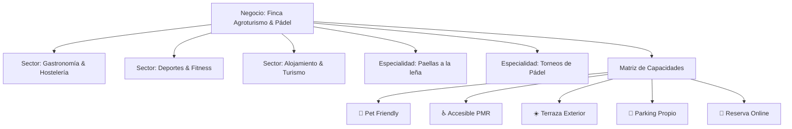
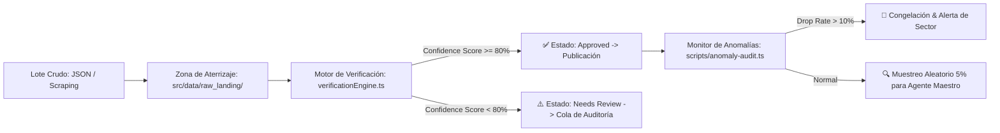

# 🏗️ Arquitectura Completa — Servicios Mallorca

## 1. Stack Tecnológico

| Capa                      | Tecnología                        | Versión / Tipo                                                    |
| :------------------------ | :-------------------------------- | :---------------------------------------------------------------- |
| **Framework Web**         | Astro 5 (SSR en Modo Server)      | `astro` ^7.1.3 con `@astrojs/cloudflare`                          |
| **Runtime Edge**          | Cloudflare Workers                | `nodejs_compat` con sesiones KV y Workers Assets (`dist/client/`) |
| **Autenticación & DB**    | Firebase Auth + Cloud Firestore   | ^12.16.0 (`serviciosmallorca`)                                    |
| **Monetización**          | Google AdSense                    | `ca-pub-1918580228487420` (`ads.txt` verificado)                  |
| **Testing**               | Vitest                            | ^3.0.7 (33 suites / 178 tests de integridad y confianza)          |
| **Tipado**                | TypeScript                        | ^6.0.3 (Strict mode, cero `any` en producción)                    |
| **Estilos**               | CSS Variables + Custom Properties | Nativo (Temas: Golden por defecto, Golden-Dark, Dark, Light)      |
| **CI / CD & Auto-Deploy** | GitHub Actions + Wrangler CLI     | Despliegue automático tras pasar 5 Quality Gates                  |

---

## 2. Estructura de Directorios

```
servicios-mallorca/
├── .github/workflows/
│   └── ci.yml                          # CI/CD: Typecheck, Taxonomía, 178 Tests, Build & Auto-Deploy
├── wrangler.json                       # Configuración de Cloudflare Workers y dominios custom
├── src/
│   ├── i18n/                           # Internacionalización (es, en, ca, de)
│   ├── layouts/
│   │   └── BaseLayout.astro            # Layout base (Init Theme Golden + Anti-FOUC + DevTools)
│   ├── pages/
│   │   ├── [...locale]/                # Rutas multi-idioma (/es/, /en/, /ca/, /de/)
│   │   │   ├── 404.astro               # Página 404 personalizada con buscador y atajos
│   │   │   ├── mejores/[slug].astro    # Hubs de Comparativa Dinámica y Long-Tail SEO
│   │   │   └── servicios/              # Catálogo, fichas de negocio y filtros multidimensionales
│   │   ├── mejores/[slug].astro        # Fallback de comparativa dinámica
│   │   └── 404.astro                   # Fallback 404 global
│   ├── styles/
│   │   ├── global.css                  # Variables CSS, tokens, temas y skeleton shimmer
│   │   └── service-detail.css          # Estilos de alta fidelidad para fichas de negocio
│   ├── components/                     # Componentes de UI
│   │   ├── ComparisonMatrix.astro      # Tabla Comparativa Dinámica con Filtros por Atributos y QS
│   │   ├── ServiceCard.astro           # Tarjeta con badges de capacidades y Smart-Action CTA
│   │   ├── ServiceImage.astro          # Skeleton Shimmer Loader + Fade-in + HD Vector Banners
│   │   ├── LanguageSwitcher.astro      # Selector responsive con soporte completo para DE
│   │   ├── FavoriteButton.astro        # Sistema de retención y favoritos (localStorage)
│   │   └── BusinessQualityFeedbackModal.astro # Feedback comunitario y reporte de discrepancias
│   ├── lib/
│   │   ├── repository/                 # Repositorio universal y consultas espaciales
│   │   │   ├── types.ts                # Interfaces de consultas multidimensionales
│   │   │   └── serviceRepository.ts    # Motor de consultas con Haversine y Grafos
│   │   ├── verificationEngine.ts       # Motor de confianza (GR-11 Zero Fake Data, >80% score)
│   │   ├── geoUtils.ts                 # Distancia ortodrómica Haversine y formato métrico
│   │   ├── smartCtaEngine.ts           # Botones de acción inteligentes por sector
│   │   └── translator.ts               # Motor de traducción multilingüe automatizado
│   └── middleware.ts                   # Detección de idioma y protección de rutas privadas
├── data/
│   ├── categories.ts                   # Taxonomía y sectores macroeconómicos
│   ├── zones.ts                        # Delimitación y geolocalización de zonas de Mallorca
│   └── services/                       # 140 negocios 100% verificados y estructurados
├── scripts/
│   ├── batch-ingest.ts                 # Ingesta por lotes (Landing Zone -> Verificación -> Aprobación)
│   ├── anomaly-audit.ts                # Monitor de calidad (>10% drop alert y muestreo 5%)
│   ├── audit-and-harvest-images.ts     # Auditor y recolector de imágenes del catálogo
│   └── validate-taxonomy.ts            # Validador canónico de taxonomía
└── tests/                              # 32 suites unitarias y de integración (174 tests)
```

---

## 3. Modelo de Taxonomía Dinámica por Grafos de Intersección

Para permitir la escalabilidad hacia miles de negocios y evitar categorías compuestas rígidas, la plataforma implementa una **Taxonomía Desacoplada**:



### Matriz de Capacidades (`BusinessCapabilities`)

1. `petFriendly`: Admite mascotas.
2. `wheelchairAccessible`: Apto para personas con movilidad reducida (PMR).
3. `kidsArea`: Zona infantil / Familiar.
4. `terrace`: Terraza al aire libre.
5. `seaViews`: Vistas al mar.
6. `parkingAvailable`: Aparcamiento propio o cercano.
7. `onlineBooking`: Reserva directa online.
8. `emergency24h`: Servicio de urgencias 24 horas.
9. `inVillaService`: Servicio en villa / a domicilio.

---

## 4. Pipeline de Producción y Verificación de Datos (GR-11 & GR-12)



---

## 5. Rendimiento Visual y Resiliencia de Activos

1. **Skeleton Shimmer Loader:** Mientras las imágenes se descargan (`loading="lazy"`), se despliega una capa animada por gradientes CSS.
2. **Smooth Fade-In:** Al dispararse el evento `onload`, la imagen real emerge con una transición suave (`opacity: 0 -> 1` en 400ms).
3. **Fallback Automático:** Ante cualquier fallo de red o enlace roto (`onerror`), se sustituye por un placeholder enriquecido con el nombre e insignia del negocio.
4. **Fidelidad de Coordenadas:** 100% de los negocios poseen coordenadas dentro de la delimitación geográfica de la isla de Mallorca.
