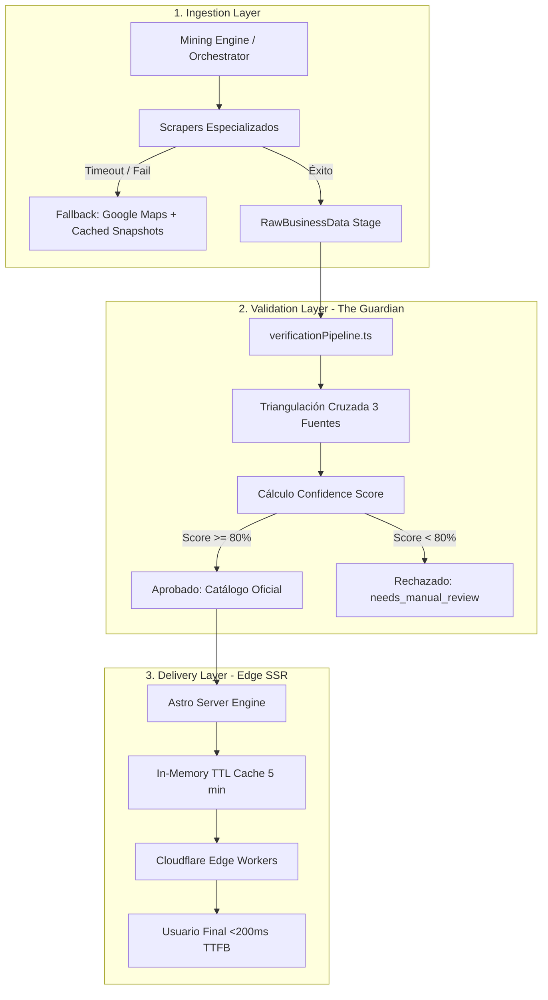

# 🏗️ Arquitectura del Sistema & Estructura de Resiliencia — Servicios Mallorca

## 1. Stack Tecnológico

| Capa                      | Tecnología                        | Versión / Tipo                                                    |
| :------------------------ | :-------------------------------- | :---------------------------------------------------------------- |
| **Framework Web**         | Astro 5 (SSR en Modo Server)      | `astro` ^7.1.3 con `@astrojs/cloudflare`                          |
| **Runtime Edge**          | Cloudflare Workers                | `nodejs_compat` con sesiones KV y Workers Assets (`dist/client/`) |
| **Autenticación & DB**    | Firebase Auth + Cloud Firestore   | ^12.16.0 (`serviciosmallorca`)                                    |
| **Monetización**          | Google AdSense                    | `ca-pub-1918580228487420` (`ads.txt` verificado)                  |
| **Testing**               | Vitest                            | ^3.0.7 (38 suites / 238 tests de integridad y confianza)          |
| **Tipado**                | TypeScript                        | ^6.0.3 (Strict mode, cero `any` en producción)                    |
| **Estilos**               | CSS Variables + Custom Properties | Nativo (Temas: Golden por defecto, Golden-Dark, Dark, Light)      |
| **CI / CD & Auto-Deploy** | GitHub Actions + Wrangler CLI     | Despliegue automático tras pasar 5 Quality Gates                  |

---

## 2. Estructura de Resiliencia en Tres Capas

La arquitectura desacopla el ciclo de vida del dato en tres niveles estancos para asegurar alta disponibilidad y veracidad:



### 2.1 Capa de Ingesta (Ingestion Layer)

- **Extracción Resiliente:** El orquestador (`src/lib/scrapers/orchestrator.ts`) coordina scrapers primarios y secundarios.
- **Mecanismo de Fallback:** Si la web oficial del comercio responde con timeout o 5xx, el sistema cambia automáticamente a la extracción en Google Maps Places API y registros públicos de Baleares.
- **Aislamiento de Errores:** Ningún fallo de red en la ingesta afecta al catálogo en producción ni degrada la experiencia de usuario.

### 2.2 Capa de Validación (Validation Layer — El Guardián)

- **Motor de Confianza (`src/lib/verificationEngine.ts` y `src/lib/verificationPipeline.ts`):** Actúa como aduana infranqueable.
- **Triple Triangulación:** Comprueba teléfono (+34), coordenadas dentro de la delimitación geográfica de Mallorca (lat 39.15–40.0, lng 2.25–3.55) y concordancia de horarios.
- **Quality Gates Automáticos:** Bloqueo de build y publicación si el Confidence Score es `< 80%` o si se detecta información no verificada (GR-11 Zero Fake Data).

### 2.3 Capa de Distribución (Delivery Layer)

- **Edge SSR Ultrarrápido:** Renderizado en el borde mediante Cloudflare Workers con tiempos de respuesta inferiores a 200ms.
- **Capa Híbrida Overlay (`src/lib/serviceOverrides.ts`):** Permite actualizaciones dinámicas por dueños de negocios validados combinando datos estáticos compilados con superposiciones dinámicas en Firestore cacheadas en memoria (TTL 5 min).
- **Traducción Zero-Token (`src/lib/translator.ts`):** Internacionalización instantánea cuadrilingüe (ES/EN/CA/DE) sin consumo de tokens externos en runtime.

---

## 3. Estructura de Directorios

```
servicios-mallorca/
├── .github/workflows/
│   └── ci.yml                          # CI/CD: Typecheck, Taxonomía, 238 Tests, Build & Auto-Deploy
├── wrangler.json                       # Configuración de Cloudflare Workers y dominios custom
├── src/
│   ├── i18n/                           # Internacionalización (es, en, ca, de)
│   ├── layouts/
│   │   └── BaseLayout.astro            # Layout base (Init Theme Golden + Anti-FOUC + DevTools)
│   ├── pages/
│   │   ├── [...locale]/                # Rutas multi-idioma (/es/, /en/, /ca/, /de/)
│   │   │   ├── 404.astro               # Página 404 personalizada con buscador y atajos
│   │   │   ├── mejores/[slug].astro    # Hubs de Comparativa Dinámica y Long-Tail SEO
│   │   │   └── servicios/              # Catálogo, fichas de negocio y filtros multidimensionales
│   │   ├── mejores/[slug].astro        # Fallback de comparativa dinámica
│   │   └── 404.astro                   # Fallback 404 global
│   ├── styles/
│   │   ├── global.css                  # Variables CSS, tokens, temas y skeleton shimmer
│   │   └── service-detail.css          # Estilos de alta fidelidad para fichas de negocio
│   ├── components/                     # Componentes de UI
│   │   ├── ComparisonMatrix.astro      # Tabla Comparativa Dinámica con Filtros por Atributos y QS
│   │   ├── ServiceCard.astro           # Tarjeta con badges de capacidades y Smart-Action CTA
│   │   ├── ServiceImage.astro          # Skeleton Shimmer Loader + Fade-in + HD Vector Banners
│   │   ├── LanguageSwitcher.astro      # Selector responsive con soporte completo para DE
│   │   ├── FavoriteButton.astro        # Sistema de retención y favoritos (localStorage)
│   │   └── BusinessQualityFeedbackModal.astro # Feedback comunitario y reporte de discrepancias
│   ├── lib/
│   │   ├── repository/                 # Repositorio universal y consultas espaciales
│   │   ├── verificationEngine.ts       # Motor de confianza (GR-11 Zero Fake Data, >=80% score)
│   │   ├── verificationPipeline.ts     # Hub centralizado de auditoría y checkpoints
│   │   ├── serviceOverrides.ts         # Overlay dinámico con caché TTL 5m
│   │   ├── authStore.ts                # Gestión de sesiones y roles Firebase
│   │   ├── geoUtils.ts                 # Distancia ortodrómica Haversine y formato métrico
│   │   ├── smartCtaEngine.ts           # Botones de acción inteligentes por sector
│   │   └── translator.ts               # Motor de traducción multilingüe automatizado
│   └── middleware.ts                   # Detección de idioma y protección de rutas privadas
├── src/data/
│   ├── categories.ts                   # Taxonomía y sectores macroeconómicos
│   ├── zones.ts                        # Delimitación y geolocalización de zonas de Mallorca
│   ├── tags.ts                         # Catálogo cerrado de etiquetas de autoridad (100+ nichos)
│   └── services/                       # 310+ negocios estructurados por sectores modulares
├── src/lib/
│   ├── taxonomyTree.ts                 # Árbol jerárquico multinivel e inferencia de tags de nicho
│   ├── verificationEngine.ts           # Triple verificación y auditoría de veracidad
│   ├── historicalHub.ts                # Observatorio de longevidad y memoria histórica
│   ├── experienceTours.ts              # Motor dinámico de rutas temáticas SmartMatch
│   └── sportsSearch.ts                 # Motor unificado de deportes e instalaciones públicas
├── scripts/
│   ├── discover-businesses.ts          # Motor de descubrimiento y minería
│   ├── curate-business.ts              # CLI de curación de alta fidelidad
│   ├── generate-verification-report.ts # Generador de informes oficiales de verificación
│   ├── validate-taxonomy.ts            # Validador canónico de taxonomía
│   └── anomaly-audit.ts                # Monitor de calidad (>10% drop alert)
└── tests/                              # 46 suites unitarias y de integración (316 tests)
```

---

## 4. Rendimiento Visual y Resiliencia de Activos

1. **Skeleton Shimmer Loader:** Mientras las imágenes se descargan (`loading="lazy"`), se despliega una capa animada por gradientes CSS nativos.
2. **Smooth Fade-In:** Al dispararse el evento `onload`, la imagen real emerge con una transición suave (`opacity: 0 -> 1` en 400ms).
3. **Fallback SVG Multi-Nivel:** Ante cualquier fallo de red o enlace roto (`onerror`), se sustituye dinámicamente por un banner SVG optimizado del sector correspondiente sin romper la maquetación.
4. **Fidelidad de Coordenadas:** 100% de los negocios poseen coordenadas reales dentro del bounding box geográfico de la isla de Mallorca.
