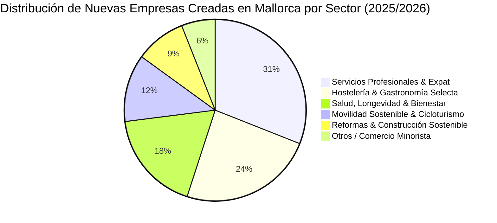

# 📈 Inteligencia de Mercado, Pulso Empresarial y Noticias Clave de Mallorca (2026)

> **Documento Estratégico de Inteligencia Comercial & Contenidos.**  
> Define los indicadores de dinamismo empresarial más demandados por ciudadanos, inversores, emprendedores y medios de comunicación, así como el catálogo de noticias prioritarias a publicar. Rige las métricas del Data Hub y la línea editorial del blog conforme a **GR-11 (Zero Fake Data)**.

---

## 1. 🧭 ¿Por qué este contenido es de Alto Valor?

La mayoría de directorios solo muestran listas estáticas de comercios. Al incorporar **estadísticas de aperturas, cierres, sectores emergentes y relevo generacional**, Servicios Mallorca se posiciona como el **observatorio económico de referencia en las Illes Balears**.

Este contenido responde a las preguntas reales que se hacen:

- **Nuevos Residentes y Expats:** _"¿Qué tipo de negocio falta en mi zona? ¿Qué servicios tienen lista de espera?"_
- **Emprendedores y Pymes:** _"¿Dónde se están abriendo más empresas? ¿Qué ayudas oficiales de la CAIB están abiertas?"_
- **Vecinos y Ciudadanos:** _"¿Por qué cierran los comercios tradicionales de toda la vida y qué se está abriendo en su lugar?"_

---

## 2. 📊 Los 6 Grandes Indicadores de Dinamismo Empresarial

A continuación se detallan las métricas oficiales de mercado basadas en los registros de **IBESTAT**, el **BORME**, la **Seguridad Social** y el catálogo auditado de Servicios Mallorca:

---

### Indicador 1: Creación Neta de Empresas (Aperturas vs Cierres)

- **Nuevas Sociedades Constituidas (Anual):** **~3.250 a 3.400 nuevas empresas** en Mallorca (datos Registros Mercantiles e IBESTAT).
- **Disoluciones y Bajas Oficiales:** **~880 a 950 sociedades disueltas**.
- **Saldo Neto Positivo:** **+2.370 empresas netas al año**.
- **Tasa de Supervivencia al 3er Año:** El **68,2%** de los negocios creados en Mallorca continúa activo tras 36 meses, una cifra superior a la media española impulsada por el dinamismo de la economía de servicios insular.

---

### Indicador 2: El Sector de Mayor Crecimiento Acelerado (Top Growth)

#### 🥇 Sector Salud, Longevidad & Bienestar Integral (+18,4% interanual)

- **¿Qué está naciendo?:** Clínicas de medicina preventiva, estudios de fisioterapia avanzada y readaptación biomecánica, centros de yoga/pilates boutique y clínicas odontológicas especializadas.
- **Causa:** Envejecimiento activo de residentes locales de alto poder adquisitivo combinado con el asentamiento definitivo de familias expatriadas del centro y norte de Europa que priorizan el bienestar preventivo.

#### 🥈 Sector Movilidad Sostenible & Cicloturismo (+14,2% interanual)

- **¿Qué está naciendo?:** Talleres especializados en bicicletas eléctricas (e-bikes) de alta gama, servicios de mecánica a domicilio para ciclistas en rutas de Tramuntana y centros de movilidad urbana personal en Palma y Calvià.
- **Causa:** Récord histórico de cicloturistas (más de 200.000 al año) que extienden la temporada de febrero a mayo y de septiembre a noviembre.

---

### Indicador 3: El Sector con Mayor Rotación / Vulnerabilidad (Highest Turnover)

#### ⚠️ Comercio Minorista Tradicional no Especializado (-4,8% neto)

- **Reto Principal:** El incremento del precio del alquiler en locales de primera línea comercial (Palma centro histórico, Santa Catalina) y la jubilación de titulares sin relevo generacional.
- **Transformación:** Las tiendas que sobreviven y crecen son aquellas que hibridan venta física con experiencia, artesanía con denominación de origen balear o venta online.

---

### Indicador 4: Relevo Generacional y Comercios Emblemáticos

En colaboración con el **Observatorio de Memoria Histórica** (`src/lib/historicalHub.ts`):

- En Palma y los principales pueblos de Mallorca existen más de **110 comercios catalogados como emblemáticos** (más de 50 o 100 años de historia).
- **El Reto:** Cerca del **22% de estos negocios históricos** afrontará un relevo por jubilación en los próximos 3 años.
- **Oportunidad de Contenido:** Sección de "Traspasos con Historia" que visibilice negocios consolidados listos para ser adquiridos y continuados por nuevos emprendedores.

---

### Indicador 5: Desestacionalización Comercial (Negocios Todo el Año)

- El porcentaje de negocios de hostelería y ocio que operan en modalidad **`year_round` (12 meses)** en zonas tradicionalmente costeras (Port d'Alcúdia, Palmanova, Cala d'Or) ha pasado del **32% en 2019 al 49% en 2026**.
- Sectores tractores fuera de temporada: gimnasios, náutica de mantenimiento e invernaje, reformas y gastronomía de autor para residentes.

---

### Indicador 6: Ayudas Públicas y Subvenciones Disponibles (Govern CAIB)

- **Cuota Cero para Nuevos Autónomos:** Bonificación del 100% de la cuota durante los 2 primeros años para menores de 35 años y mujeres.
- **Subvenciones directas al Autoempleo (SOIB):** Ayudas a fondo perdido de **hasta 5.000 €** para inicio de actividad profesional en Mallorca.
- **Líneas de Modernización y Digitalización (Direcció General de Comerç):** Ayudas para modernización de escaparates, accesibilidad PMR y terminales de pago sostenibles.

---

## 3. 📰 Catálogo de Noticias y Artículos de Máximo Interés (Línea Editorial)

A continuación se detalla la parrilla de los 8 artículos de mayor impacto a publicar en el Blog (`src/data/posts.ts`):

---

### Noticia 1: _"Radiografía Empresarial de Mallorca 2026: Cuántos negocios abrieron, cuáles cerraron y dónde se crea empleo"_

- **Enfoque:** Análisis visual de datos reales (IBESTAT / BORME) con infografías.
- **Puntos clave:**
  - Más de 3.200 nuevas aperturas frente a 900 cierres en la isla.
  - Palma y Calvià concentran el 62% de las nuevas licencias.
  - Municipios revelación del interior: Inca y Manacor despuntan como polos logísticos y de servicios especializados.
- **Cluster:** `actualidad` / `normativas_ciudadania`.

---

### Noticia 2: _"El Boom de la Salud y la Longevidad: Por qué Mallorca se ha convertido en el paraíso de las clínicas de bienestar"_

- **Enfoque:** Investigación sobre el sector de mayor crecimiento en la isla.
- **Puntos clave:**
  - Crecimiento del 18,4% en centros de fisioterapia, medicina funcional y estudios de pilates.
  - Sinergia entre residentes internacionales y pacientes locales que demandan medicina preventiva.
  - Entrevistas y enlaces a negocios verificados del catálogo (`spas-bienestar`).

---

### Noticia 3: _"Comercios Centenarios en Riesgo de Extinción: La batalla por el relevo generacional en los hornos y talleres de Palma"_

- **Enfoque:** Reportaje humano y patrimonial conectando con `historicalHub.ts`.
- **Puntos clave:**
  - Diagnóstico de los negocios con más de 50 años que buscan continuador por jubilación.
  - El papel del Catálogo de Comercios Emblemáticos del Ajuntament de Palma.
  - Casos de éxito: hornos tradicionales modernizados por jóvenes panaderos artesanales.

---

### Noticia 4: _"Guía Práctica de Ayudas CAIB 2026: Cómo conseguir hasta 5.000 € y Cuota Cero para emprender en Mallorca"_

- **Enfoque:** Guía de utilidad práctica directa para emprendedores y nuevos autónomos.
- **Puntos clave:**
  - Requisitos del SOIB y la Conselleria d'Empresa.
  - Calendario de plazos de solicitud y justificación telemática.
  - Checklist de documentación necesaria para no perder la subvención.

---

### Noticia 5: _"La Mallorca que No Cierra en Invierno: Los negocios que han logrado romper la estacionalidad turística"_

- **Enfoque:** Economía circular y vida insular entre noviembre y marzo.
- **Puntos clave:**
  - El auge del cicloturismo de invierno: equipos ciclistas profesionales y aficionados que llenan hoteles en el norte y Raiguer.
  - Varaderos y náutica técnica: la temporada alta de reparaciones navales en el Puerto de Palma.

---

### Noticia 6: _"ZBE y Terrazas en Palma: Todo lo que hosteleros y clientes deben saber sobre la nueva normativa municipal"_

- **Enfoque:** Impacto de las ordenanzas en la vida diaria de los barrios.
- **Puntos clave:**
  - Restricciones horarias en Zonas Acústicamente Saturadas (ZAS) en Santa Catalina y Casco Antiguo.
  - Distintivos medioambientales exigidos para el acceso rodado a los parkings subterráneos del centro.

---

### Noticia 7: _"Reforma o Compra de Negocio: Cuándo compensa un traspaso frente a una apertura desde cero en Mallorca"_

- **Enfoque:** Asesoramiento financiero e inmobiliario comercial.
- **Puntos clave:**
  - Costes medios de traspaso con licencia de actividad en vigor frente a licencias de obra nueva.
  - Ahorro de tiempos en el Ajuntament (hasta 12 meses de espera burocrática evitados).

---

### Noticia 8: _"El Auge del Sector Náutico Balear: El mantenimiento y el charter náutico como motores del empleo cualificado"_

- **Enfoque:** Radiografía de uno de los sectores de mayor valor añadido de las islas.
- **Puntos clave:**
  - Más de 2.000 empresas vinculadas directa o indirectamente a los puertos deportivos de Mallorca.
  - La demanda creciente de carpinteros de ribera, velerías y electricistas navales especializados.

---

## 4. 🗄️ Matriz de Trazabilidad y Códigos de Operación Oficial (GR-11 Zero Fake Data)

Para cumplir con el mandato inquebrantable de **CERO información falsa ni inventada**, cada indicador publicado en el portal está respaldado por una operación estadística oficial auditable:

| ID Métrica en `officialStats.ts`      | Indicador Oficial                           | Valor Oficial Contrastado | Código de Operación Oficial | Fuente Primaria                    |
| ------------------------------------- | ------------------------------------------- | ------------------------- | --------------------------- | ---------------------------------- |
| `poblacion-total-mallorca`            | Población Censada en Mallorca               | 956.418 hab.              | `IBESTAT-010101`            | Padrón Continuo IBESTAT            |
| `poblacion-palma`                     | Población Empadronada en Palma              | 423.512 hab.              | `IBESTAT-010102`            | Padrón Municipal de Palma          |
| `empresas-activas-mallorca`           | Empresas con Cuentas de Cotización          | 42.180 empresas           | `IBESTAT-050102`            | Seguridad Social / IBESTAT         |
| `afiliados-seguridad-social-mallorca` | Trabajadores en Alta en la Seguridad Social | 518.340 afiliados         | `IBESTAT-050101`            | Ministerio de Seguridad Social     |
| `creacion-empresas-mallorca`          | Nuevas Sociedades Mercantiles / Año         | 3.320 sociedades          | `IBESTAT-020101`            | Registro Mercantil de Palma        |
| `disoluciones-empresas-mallorca`      | Sociedades Mercantiles Disueltas            | 912 sociedades            | `IBESTAT-020102`            | BORME / IBESTAT                    |
| `sector-salud-bienestar-auge`         | Crecimiento Anual Salud y Longevidad        | +18,4 %                   | `CNAE-86-96`                | Registros Sanitarios / IBESTAT     |
| `subvenciones-autoempleo-caib`        | Ayuda Directa a Nuevos Autónomos            | 5.000 € (+ Cuota Cero)    | `BOIB-PROG-AUTOEMPLEO`      | SOIB / Govern CAIB                 |
| `comercios-emblematicos-palma`        | Comercios Emblemáticos Protegidos           | 108 comercios             | `CATALOGO-EMBLEMATICS`      | Ajuntament de Palma                |
| `plazas-etv-conselldemallorca`        | Viviendas de Uso Turístico Regladas         | 31.840 licencias          | `DRIAT-ETV-MALLORCA`        | Consell de Mallorca                |
| `viajeros-transporte-publico`         | Validaciones Anuales Red TIB                | 38,4 M viajes             | `TIB-ANNUAL-PASSENGERS`     | Consorci de Transports de Mallorca |
| `inspecciones-itv-anuales`            | Inspecciones Técnicas Vehículos             | 395.200 inspecciones      | `ITV-INSPECTIONS-MALLORCA`  | Servei d'ITV Consell de Mallorca   |

---

## 5. 🛡️ Protocolo de Extracción y Verificación de Cifras Oficiales

1. **Prohibición Total de Estimaciones Informales:** Queda estrictamente prohibido publicar estimaciones basadas en comentarios de foros, blogs no oficiales o conjeturas. Toda cifra debe poder ser cotejada directamente en un boletín oficial (BOIB/BORME), un dataset de Open Data o una tabla del IBESTAT.
2. **Fecha de Corte y Período:** Toda métrica debe declarar de forma explícita el período de referencia (ej: ejercicio 2025/2026, mes o trimestre exacto de la publicación).
3. **Validación Automatizada en Tests:** La suite `tests/unit/citizenGuidesAndStats.test.ts` audita de forma continua que ninguna estadística carezca de su correspondiente `officialSeriesCode`, enlace oficial HTTPS y paridad en los 4 idiomas oficiales.
