# 🔄 Revisión Técnica del Flujo de Titularidad: Reclamar / Crear / Editar Negocios — Servicios Mallorca

> **Informe de Auditoría (Documento Vivo)**
> Revisión exhaustiva del ciclo de vida del dato desde que un usuario **reclama** una ficha existente, **crea** un negocio nuevo, o **edita** información personalizada de su negocio verificado.
>
> Este documento **no duplica** los SOP existentes ([`BUSINESS_REGISTRATION_PROCESS.md`](BUSINESS_REGISTRATION_PROCESS.md) y [`DATA_VERIFICATION_PROTOCOL.md`](DATA_VERIFICATION_PROTOCOL.md)); es la auditoría técnica del estado real del código con hallazgos accionables y un plan de remediación por fases.

---
<details>
<summary>📌 Estado de la revisión</summary>

| Campo             | Valor                                                                 |
| ----------------- | --------------------------------------------------------------------- |
| Fecha de análisis | 2026-09-27                                                            |
| Rama audited      | `main` (commit `02d8865`)                                              |
| Alcance           | `firestore.rules`, `src/lib/serviceActions.ts`, `src/lib/serviceOverrides.ts`, `src/lib/managerSecurityEngine.ts`, `src/lib/userProfile.ts`, `src/components/DashboardManager.astro`, `src/components/DashboardAdmin.astro`, `src/components/DashboardUser.astro`, `src/components/ProfileForm.astro`, `src/components/ServiceClaimDeleteModals.astro`, `src/scripts/service-detail-client.ts`, `src/pages/[...locale]/servicios/nuevo.astro` |
| Golden Rules afectadas | GR-04, GR-05, GR-06, GR-08, GR-11, GR-12, GR-13, GR-15, GR-16      |
</details>

### 🔬 Metodología y trazabilidad de la evidencia

Todas las referencias `archivo:línea` de este documento fueron **verificadas una a una** con búsqueda dirigida (`Select-String`) y lectura del rango exacto sobre el árbol de trabajo, no inferidas. Cuando una capacidad existe pero **no tiene consumidores** (p. ej. `mergeServiceWithOverride`), se declara explícitamente como *código desconectado* en lugar de asumir su funcionamiento (GR-11: veracidad y contraste).

### 📊 Resumen cuantitativo

| Severidad | Nº hallazgos | Estado |
| --------- | ------------ | ------ |
| 🟥 P0 (seguridad / integridad) | 5 | ✅ **Remediados en Fase 1** (ver §0) |
| 🟧 P1 (flujo de datos)         | 4 | 1 cerrado · 3 pendientes (Fase 2)      |
| 🟨 P2 (UX / trazabilidad)      | 8 | 5 cerrados · 3 pendientes (Fase 3)     |

---

## 0. Estado de remediación (Fase 1 ejecutada · 2026-09-27)

> Las tablas de §5 documentan **el estado encontrado durante la auditoría**. Esta sección es el **estado vigente** tras la Fase 1 del plan. Los invariantes `INV-01…INV-08` viven en [`AGENTS.md`](AGENTS.md) § Bloque Vinculante y **siguen vigentes** aunque el hallazgo esté cerrado.

| Hallazgo | Estado | Evidencia del cierre |
| -------- | ------ | -------------------- |
| **P0-1** El manager falsifica su propio sello | ✅ Cerrado | `firestore.rules` bloquea los 12 campos de verificación en `create`/`update` de `service_overrides`; además `stripVerificationFields()` los filtra para actores `manager` (defensa en profundidad) |
| **P0-2** Sello oficial sin método/documento | ✅ Cerrado | `verifyBusinessAsAdmin` lanza `OverrideGuardError("missing_evidence")` sin `verificationMethod` + `documentUrl` https; registra `verifiedByUid`/`verifiedByRole`; `DashboardAdmin.astro` exige el documento al administrador |
| **P0-3** Claims duplicados | ✅ Cerrado | `buildClaimId()` (ID determinista) + preflight `duplicate_claim` / `already_claimed` en `createServiceClaim` + regla `!exists(...)` y `status == 'pending'` en Firestore |
| **P0-4** La verificación del admin secuestra `ownerUid` | ✅ Cerrado | `resolveOwnerUid()` nunca sobrescribe un `ownerUid` existente y el admin jamás se apropia de la ficha; `getServiceOverrideFresh()` lee sin caché antes de decidir; eliminado el literal `"admin"` de `DashboardAdmin.astro` |
| **P0-5** Escalada de rol sin negocio | ✅ Cerrado | `updateClaimStatus` exige `applicantUid` + `serviceId` (`missing_business`) y escribe **un único `writeBatch`**: claim + `users.role` + `managedServices` (`arrayUnion`) + override con la titularidad del solicitante |
| **P1-3** Motor de merge desconectado | ✅ Cerrado (cliente) · ⏳ SSR (Fase 2.4) | La hidratación aplica `mergeServiceWithOverride` sobre la isla `#service-static-data` y publica descripción, destacados, servicios, email y estado operativo |
| **P1-4** Cero validaciones / `as any` | 🟡 Parcial | Escritura con actor tipado y validado; queda el motor de validación compartido (Fase 2.3) |
| **P2-2** Sin audit trail | ✅ Cerrado | `saveServiceOverride` escribe `auditTrail` (`authorRole`, `authorUid`, `fieldChanged`, `oldValue`, `newValue`, `reason`, máx. 20) y la aprobación añade la entrada `claimed` |
| **P2-4** Sin notificación al usuario | 🟡 Parcial | El titular recibe el error tipado en la propia ficha; la bandeja de notificaciones es Fase 3 (3.2) |
| **P2-5** `catch` silenciosos | ✅ Cerrado | `clientTelemetry.reportClientFailure()` (consola + `/api/logs/ingest`, dedupe 5 min) sustituye a todos los `catch` mudos de `serviceActions.ts` y `serviceOverrides.ts` |
| **P2-6** Sin rate limiting | ✅ Cerrado | `checkRateLimit("claim:{uid}", 3, 15 min)` antes de escribir la reclamación |
| **P2-7** Botones Aprobar/Rechazar en el panel del manager | ✅ Cerrado | Solo se renderizan con `role === "admin"`; el manager ve el estado sin acciones que fallarían por reglas |

**Verificación de la Fase 1:** `npx tsc --noEmit` → 0 errores · `npx vitest run` → 97 ficheros / 850 tests en verde · `npm run build` → OK. Cobertura de invariantes en `tests/unit/serviceActions.test.ts`, `tests/unit/serviceOverrides.test.ts` y `tests/unit/firestoreRulesStatic.test.ts` (GR-05).

---

## 1. Mapa General del Flujo Actual

```mermaid
graph TD
    subgraph "Vía A · Reclamar Ficha Existente"
        A0[User en /servicios/slug] --> A1[Modal Reclamar: nombre, email, tel, CIF]
        A1 --> A2[createServiceClaim -> service_claims pending + LocalStorage]
        A2 --> A3[Admin audita con evaluateClaimSecurity en /dashboard]
        A3 --> A4[updateClaimStatus approved, uid, serviceId]
        A4 --> A5[assignBusinessToUser -> rol manager + managedServices]
        A4 --> A6[saveServiceOverride: isClaimed, verified_official, score 98]
        A6 --> A7[hydrateDynamicOverrides en ficha pública: tel, whatsapp, web, horario, badge]
    end

    subgraph "Vía B · Crear Negocio Nuevo (Submission)"
        B0[User en /servicios/nuevo] --> B1[Form: nombre, cat, zona, dirección, tel, web, desc]
        B1 --> B2[createServiceSubmission -> service_submissions pending]
        B2 --> B3[Admin aprueba -> updateSubmissionStatus approved]
        B3 -.->|❌ ROTO: solo cambia el estado| B4[Sin ficha en catálogo / Sin mando manager]
    end

    subgraph "Vía C · Editar Negocio (Manager Overlay)"
        C0[/dashboard role=manager/] --> C1[DashboardManager lista negocios]
        C1 --> C2[Modal edición: tel, whatsapp, web, horario, estado, desc ES]
        C2 --> C3[saveServiceOverride merge en service_overrides/slug]
        C3 --> C4[hydrateDynamicOverrides aplica solo 4 campos + badge]
    end
```



---

## 2. Vía A — Reclamación de Titularidad (estado real del código)

### 2.1 Flujo de creación del claim

| Paso | Dónde | Qué hace |
| ---- | ----- | -------- |
| 1 | `src/components/ServiceSidebarContact.astro:169-174` | Botón "⚡ Reclamar Titularidad (0€)" abre `#claim-modal` |
| 2 | `src/components/ServiceClaimDeleteModals.astro:26-59` | Formulario: nombre solicitante, email, teléfono, CIF/prueba (`required`) |
| 3 | `src/scripts/service-detail-client.ts:108-205` | Submit: valida **solo** nombre ≥2, email regex, teléfono ≥9, CIF ≥3; pre-rellena email/nombre si hay sesión |
| 4 | `src/lib/serviceActions.ts:131-154` | `createServiceClaim` persiste en `service_claims/{id}` con `status:"pending"` + **LocalStorage** (híbrido offline) |
| 5 | `src/components/DashboardAdmin.astro:1178-1254` | Admin ve el claim con **auditoría del motor de seguridad fiscal** (`evaluateClaimSecurity`): CIF/NIF válido, teléfono balear, dominio corporativo, email desechable → score 0-100 |

### 2.2 Flujo de aprobación (cesión de titularidad)

| Paso | Dónde | Qué hace |
| ---- | ----- | -------- |
| 1 | `src/components/DashboardAdmin.astro:1273-1289` | Click "✓ Aprobar y verificar titularidad (Manager)" |
| 2 | `src/lib/serviceActions.ts:211-276` | `updateClaimStatus(db, id, "approved", uid, serviceId)`: |
|    | → `:218-231` | actualiza estado en LocalStorage (`console.warn` en `:229`) |
|    | → `:233-238` | actualiza `service_claims/{id}.status` (requiere rol admin por reglas) |
|    | → `:240-272` | rama `status === "approved"`: cede titularidad |
|    | → `:242-244` | `assignBusinessToUser(db, uid, serviceId)` → `users/{uid}.role = "manager"` + `managedServices[]` |
|    | → `:252-261` | `saveServiceOverride(slug, uid, { isClaimed:true, claimedByUid, claimedAt, verified:true, verificationStatus:"verified_official", trustLevel:"level_3_official", confidenceScore:98, lastVerifiedAt })` — valores **hardcodeados** |
|    | → `:262-264` | si el override falla: `console.warn` y el claim queda aprobado **sin** sello oficial (estado inconsistente) |
|    | → `:265-271` | rama `else`: si no hay `serviceId` o no se encuentra en `SERVICES`, asigna `role: "manager"` **sin** `managedServices` |
| 3 | `src/scripts/service-detail-client.ts:357-415` | `hydrateDynamicOverrides()` aplica en el DOM: teléfono (`:365`), whatsapp (`:368`), web (`:373`), horario (`:378`) y sustituye el banner por "👑 Ficha Oficial Gestionada por el Titular" |

### 2.3 Visibilidad para el usuario

- `src/components/ProfileForm.astro:206-236` (plantilla) + `:877-910` (lógica): la caja "🏢 Mi Empresa / Ficha Reclamada" muestra el **último claim** (`getUserClaims` → `claims[0]`) con badge de estado y texto según approved/pending/rejected.
- `src/components/DashboardUser.astro:24-40` (plantilla) + `:154-200` (lógica): lista de claims y submissions con badge de estado.

---

## 3. Vía B — Creación de Negocio Nuevo (estado real del código)

| Paso | Dónde | Qué hace |
| ---- | ----- | -------- |
| 1 | `src/pages/[...locale]/servicios/nuevo.astro:36-94` | Formulario (`#new-service-form`): `#srv-name`, `#srv-category`, `#srv-zone`, `#srv-address`, `#srv-phone`, `#srv-website`, `#srv-desc` |
| 2 | `nuevo.astro:221` / `:255` | Import y llamada a `createServiceSubmission`; **sin validación de negocio** (solo HTML5 `required`) |
| 3 | `src/lib/serviceActions.ts:281-291` | `createServiceSubmission` → `service_submissions/{id}` `pending` |
| 4 | `src/components/DashboardAdmin.astro:1335-1358` | Admin click "✓ Aprobar Propuesta" (`:1349`) → `updateSubmissionStatus(db, id, "approved")` |

### ⚠️ Hallazgo crítico de la Vía B

`updateSubmissionStatus` (`serviceActions.ts:318-328`) únicamente actualiza el campo `status` del documento de la solicitud:

```typescript
// serviceActions.ts:318-328 — comportamiento real
export async function updateSubmissionStatus(db, submissionId, status) {
  await updateDoc(doc(db, "service_submissions", submissionId), {
    status,
    updatedAt: serverTimestamp(),
  });
}
```

**Consecuencia:** aprobar una propuesta no crea la ficha en el catálogo, no genera slug, no asigna `managedServices` al usuario y no eleva su rol. **El usuario que crea un negocio nunca puede editarlo → flujo roto.**

---

## 4. Vía C — Edición de Negocio por el Manager (estado real del código)

| Paso | Dónde | Qué hace |
| ---- | ----- | -------- |
| 1 | `src/components/DashboardManager.astro:278` / `:298-392` | Import de `getServiceOverride`/`saveServiceOverride` + `authStore.subscribe` → claims propios + `managedServices` del perfil → lista negocios |
| 2 | `DashboardManager.astro:434-443` | Abre modal cargando override existente (`getServiceOverride`, prioridad) o datos estáticos |
| 3 | `DashboardManager.astro:74-102` | Campos editables: **solo** `#edit-phone`, `#edit-whatsapp`, `#edit-website`, `#edit-schedule`, `#edit-status` y `#edit-description` (descripción ES) |
| 4 | `DashboardManager.astro:474-483` | Submit → `saveServiceOverride(db, slug, user.uid, {...})` con `status: statusSelect.value as any` en `:479` |
| 5 | `src/lib/serviceOverrides.ts:165-188` | `saveServiceOverride` escribe en Firestore (`setDoc` merge, `:178`) e invalida/actualiza caché en memoria TTL 5 min (`:181-187`) |
| 6 | `src/scripts/service-detail-client.ts:357-415` | Hidratación dinámica en la ficha pública (`hydrateDynamicOverrides`, invocada en `:476`) |

---

## 5. Hallazgos por Severidad

### 5.1 🟥 P0 — Seguridad e Integridad

| ID | Hallazgo | Evidencia | Implicación Golden Rule |
| -- | -------- | --------- | ----------------------- |
| **P0-1** | **Un manager puede falsificar su propio sello de verificación.** Las reglas de `service_overrides` solo exigen que `ownerUid` coincida; **no restringen campos**. Cualquier manager puede guardar `verified:true`, `verificationStatus:"verified_official"`, `trustLevel:"level_3_official"`, `confidenceScore:98` mediante `saveServiceOverride` y lucir el badge "👑 Ficha Oficial Gestionada por el Titular" | `firestore.rules:98-109`; `serviceOverrides.ts:165-188` | GR-11 (cero sellos falsos), GR-13 (seguridad) |
| **P0-2** | **Sello oficial automático sin método de verificación documentado.** La aprobación del claim escribe `verified:true` + `verified_official` + `confidenceScore:98` de forma hardcodeada (`serviceActions.ts:252-261`), y `verifyBusinessAsAdmin` (usado por el panel admin, `DashboardAdmin.astro:1501, 1601`) hace lo propio con `confidenceScore: 95`. Ninguna de las dos rutas exige `verificationMethod` ni `documentUrl`, aunque `ClaimVerificationPayload` los define (`managerSecurityEngine.ts:14-23`) y `evaluateClaimSecurity` los puntúa (`:132-170`, `hasProofDocument` en `:170`). El solicitante sí envía `verificationProof` (validado por reglas, `firestore.rules:116-119`) pero **nunca se persiste en el sello** | `serviceActions.ts:252-261`; `serviceOverrides.ts:194-219`; `managerSecurityEngine.ts:14-23, 132-170` | GR-11 |
| **P0-3** | **Sin deduplicación de claims:** un usuario puede reclamar el mismo `serviceId` N veces (id `claim-${serviceId}-${uid}-${Date.now()}` es único por timestamp); tampoco se comprueba si la ficha ya tiene titular (`claimedByUid`) antes de aceptar una nueva cesión | `service-detail-client.ts:168`; `serviceActions.ts:131-154` | GR-13, GR-08 (integridad de datos) |
| **P0-4** | **La verificación del admin secuestra la titularidad del override:** `verifyBusinessAsAdmin` delega en `saveServiceOverride(db, slug, adminUid, …)`, y esta función **siempre sobrescribe `ownerUid` con el uid que invoca** (`:174`). Como las reglas permiten al manager escribir solo si `resource.data.ownerUid == request.auth.uid` (`firestore.rules:104-105`), tras una verificación del admin **el manager legítimo queda bloqueado** para editar su propia ficha. Además, si no hay sesión se usa el literal `"admin"` como uid (`DashboardAdmin.astro:1494, 1595`) | `serviceOverrides.ts:165-178, 194-219`; `firestore.rules:100-107`; `DashboardAdmin.astro:1501-1506, 1601-1606` | GR-13, GR-11, GR-08 |
| **P0-5** | **Escalada de rol sin negocio asignado:** en la rama `else` de `updateClaimStatus`, si no se aporta `serviceId` (o el `serviceId` no se encuentra en `SERVICES`), el usuario pasa a `role: "manager"` con `managedServices` vacío → rol elevado sin titularidad real. No existe transacción atómica entre claim + rol + override | `serviceActions.ts:243-251, 265-271` | GR-13 |

### 5.2 🟧 P1 — Flujo de datos incompleto

| ID | Hallazgo | Evidencia | Implicación |
| -- | -------- | --------- | ----------- |
| **P1-1** | **Vía B rota:** aprobar una submission solo cambia `status`; no crea ficha ni asigna titularidad → el creador jamás puede gestionar su negocio | `serviceActions.ts:318-328`; `DashboardAdmin.astro:1335-1358` | GR-16 (ciclo de vida del dato) |
| **P1-2** | **Editor del manager limitado a 6 campos** y descripción **solo en español**. No edita email, dirección, galería, imagen, redes, highlights, servicesProvided, shortDescription, precios, etc. **Cero multilenguaje** en el modal | `DashboardManager.astro:74-102, 474-483` | GR-04 (viola i18n) |
| **P1-3** | **El motor de merge real está desconectado.** `mergeServiceWithOverride` (`serviceOverrides.ts:105-160`) fusiona *todos* los campos (email, web, descripciones i18n, highlights, servicesProvided, gallery, image, estado, verificación y titularidad), pero **no tiene ningún consumidor en `src/`**: la única invocación está en `tests/unit/serviceOverrides.test.ts`. La ficha pública (`[slug].astro`) no importa ningún módulo de overrides y la hidratación cliente solo parchea 4 campos + badge (`service-detail-client.ts:365-379`) → **todo lo demás que el manager/admin guarda es invisible en producción** | `serviceOverrides.ts:105-160`; ausencia de imports en `src/`; `service-detail-client.ts:365-379` | GR-16, GR-08 |
| **P1-4** | **Cero validaciones en `saveServiceOverride`:** teléfonos vacíos, URLs inválidas, `status as any` sin contraste contra `ServiceStatus` | `DashboardManager.astro:474-483` (paso `statusSelect.value as any`); `serviceOverrides.ts:165-188` | GR-03, GR-11 |

### 5.3 🟨 P2 — UX, trazabilidad y cumplimiento

| ID | Hallazgo | Evidencia |
| -- | -------- | --------- |
| **P2-1** | **Sin merge SSR de overrides:** la página `[slug].astro` **no importa** ningún módulo de overrides (verificado por búsqueda recursiva en `src/`), por lo que el HTML inicial se renderiza solo con datos estáticos. La única vía de actualización es la hidratación cliente con caché TTL de 5 min (`serviceOverrides.ts:74, 82-84`) → primer render, `no-JS` y crawlers (SEO/GEO) ven datos obsoletos | `src/pages/[...locale]/servicios/[slug].astro` (sin imports); `service-detail-client.ts:362, 476`; `serviceOverrides.ts:74` |
| **P2-2** | **Sin audit trail:** existen `DetailedAuditTrailEntry` y `evolutionHistory`, pero `saveServiceOverride` no registra `authorRole`/`authorUid`/`fieldChanged`/`oldValue`/`newValue` | `types.ts:12-22`; `serviceOverrides.ts:165-188` |
| **P2-3** | **Textos hardcodeados en español** (violación sistemática GR-04) en: claim modal (`ServiceClaimDeleteModals.astro`), `nuevo.astro`, `DashboardManager.astro`, `DashboardUser.astro`, `DashboardAdmin.astro` y mensajes de error en `service-detail-client.ts:153-165` | Varios |
| **P2-4** | **Sin notificación al usuario** cuando su claim/submission es aprobada o rechazada (solo aparece si vuelve al perfil: `ProfileForm` pinta el estado del **último** claim, `claims[0]`; los anteriores quedan invisibles en esa caja) | `ProfileForm.astro:206-236, 887-905`; `DashboardUser.astro:154-200` |
| **P2-5** | **Catch silenciosos (`console.warn`) en rutas críticas** de persistencia: `createServiceClaim` (`:152`), `updateClaimStatus` (`:229`, `:263`, `:274`), y el caso más grave `getServiceOverride` con `catch { return null }` sin log ni telemetría (`serviceOverrides.ts:96-98`) → la UI puede mostrar éxito sin persistencia real y los fallos de lectura son indistinguibles de "no hay override" (**viola GR-15**) | `serviceActions.ts`; `serviceOverrides.ts:96-98` |
| **P2-6** | **Sin rate limiting** en creación de claims/submissions pese a existir `checkRateLimit` (`managerSecurityEngine.ts:283-303`) | `service-detail-client.ts:139-205`; `nuevo.astro:221-281` |
| **P2-7** | **DashboardManager renderiza botones Aprobar/Rechazar para el propio manager** sobre sus claims (`:329`, `:332`), que fallarán por reglas Firestore (solo admin puede `update`/`delete` en `service_claims`, `firestore.rules:124`) — ruido e inconsistencia de permisos en la UI | `DashboardManager.astro:320-340`; `firestore.rules:124` |
| **P2-8** | Inconsistencia de permisos: la colección `services` permite `create` a `manager` aunque el catálogo público es estático (TS) y la capa dinámica es `service_overrides` | `firestore.rules:82-93` |

---

## 6. Plan de Remediación por Fases

> Cada fase concluye con tests unitarios (GR-05), actualización de `docs/` (GR-06) y suite completa:
> `npm run typecheck && npm test && npm run validate:taxonomy && npm run build`.

### Fase 1 — Blindaje P0 (Seguridad e Integridad)

> ✅ **Fase 1 ejecutada el 2026-09-27.** Las casillas se conservan como referencia del plan original; el estado vigente de cada hallazgo está en **§0**. Verificaciones: `tsc` 0 errores · 97 ficheros / 850 tests · build OK.

- [ ] **1.1** Endurecer `firestore.rules` para `service_overrides`: los campos de estado de verificación (`verified`, `verificationStatus`, `trustLevel`, `confidenceScore`, `isClaimed`, `claimedByUid`, `claimedAt`, `lastVerifiedAt`) **solo escribibles por `admin`**; el manager conservará escritura únicamente sobre campos de contenido (`phone`, `whatsapp`, `email`, `website`, `schedule`, `fullDescription`, `highlights`, `servicesProvided`, `gallery`, `image`, `status` con valores whitelist).
- [ ] **1.2** `updateClaimStatus` solo sellará `verified_official`/`confidenceScore` cuando el admin aporte `verificationMethod` (y opcionalmente `documentUrl`); si el score de `evaluateClaimSecurity` < umbral (p. ej. 70), estado intermedio `pending_audit` en lugar de sello oficial instantáneo.
- [ ] **1.3** Bloquear claims duplicados: (a) en cliente, desactivar el botón si ya existe claim `pending`/`approved` del usuario para el mismo `serviceId`; (b) en reglas Firestore, impedir crear claim si el `serviceId` ya está reclamado (documento de estado) o el usuario ya tiene uno `pending`.
- [ ] **1.4** Separar **autoría** de **verificación**: introducir `verifiedByUid` / `verifiedByRole` en `ServiceOverride` y hacer que `saveServiceOverride` **no sobrescriba `ownerUid`** cuando el escritor es `admin`. Así la verificación del admin no bloquea al manager legítimo (P0-4). Prohibir el literal `"admin"` como uid de respaldo en `DashboardAdmin`.
- [ ] **1.5** Aprobar un claim debe ser **atómico** (transacción o `writeBatch`): `service_claims.status` + `users.role` + `users.managedServices` + `service_overrides` en una sola operación. Prohibido elevar a `manager` sin `managedServices` (P0-5).
- [ ] **1.6** Tests de reglas y flujo anti-falsificación: (a) manager NO puede escribir campos de verificación; (b) verificación admin preserva `ownerUid`; (c) no hay escalada de rol sin negocio; (d) approve idempotente. Ampliar `tests/unit/serviceOverrides.test.ts` y el pipeline de seguridad.

### Fase 2 — Flujo de datos completo (P1)

- [ ] **2.1** Pipeline de aprobación de submission: al aprobar, generar `slug` a partir de `name`, registrar en catálogo, `assignBusinessToUser(uid, serviceId)` y crear `service_overrides/{slug}` base con `isClaimed:true`. La aprobación devuelve la ficha para que el creador la gestione. Documentar el contrato en `BUSINESS_REGISTRATION_PROCESS.md`.
- [ ] **2.2** Editor manager completo multi-idioma (`es`/`en`/`ca`/`de`): email, dirección, horario, estado (4 valores de `ServiceStatus`), website, teléfono/WhatsApp, descripciones (`shortDescription` + `fullDescription`), highlights, servicesProvided, imagen y galería.
- [ ] **2.3** **Motor de validación compartido** (módulo tipado, sin lógica duplicada) reutilizando `validateBalearicPhone`, `validateSpanishTaxId`, validación de URLs y límites de longitud; aplicado al formulario de claim, `nuevo.astro` y al modal manager. Eliminar los regex inline de `service-detail-client.ts:153-165`.
- [ ] **2.4** **Reconectar `mergeServiceWithOverride`**: aplicarlo en `src/pages/[...locale]/servicios/[slug].astro` (merge SSR sobre el registro estático) y en la hidratación cliente, de modo que email, descripciones i18n, estado, imagen, galería, highlights y servicesProvided se reflejen en producción (P1-3). Añadir test de integración que garantice que la página consume el merge.

### Fase 3 — UX, i18n y telemetría (P2)

- [ ] **3.1** Centralizar todos los textos de formularios en `src/i18n/locales/{es,en,ca,de}` y eliminar hardcodes (claim, nuevo, manager, dashboard).
- [ ] **3.2** Notificaciones de aprobación/rechazo (bandeja en perfil + toast) y timeline visual del estado del claim (`pending → approved/rejected`).
- [ ] **3.3** Audit trail en cada `saveServiceOverride` usando `DetailedAuditTrailEntry` (`authorRole`: `"manager"` o `"admin"`, `authorUid`, `fieldChanged`, `oldValue`, `newValue`, `timestamp`).
- [ ] **3.4** Rate limiting con `checkRateLimit` en la creación de claims/submissions (clave `claim:uid:serviceId` / `submission:uid`).
- [ ] **3.5** Sustituir catch silenciosos por `d1Logger` (GR-15) en `serviceActions.ts` y `serviceOverrides.ts`.
- [ ] **3.6** Corrección de permisos: DashboardManager solo muestra acciones de moderación a `admin`; revisión de la regla `services` create para coherencia con el modelo de catálogo estático.

### Fase 4 — Verificación final

- [ ] Suite completa: `npm run typecheck && npm test && npm run validate:taxonomy && npm run build`.
- [ ] Commit con actualización de `src/data/changelog.ts` si se despliegan cambios de calado (GR-16).

---

## 7. Referencias Cruzadas

- Proceso operativo de las 4 vías: [`BUSINESS_REGISTRATION_PROCESS.md`](BUSINESS_REGISTRATION_PROCESS.md)
- Protocolo de curación y capa dinámica (Overlay Pattern): [`DATA_VERIFICATION_PROTOCOL.md`](DATA_VERIFICATION_PROTOCOL.md) (§5 y §6)
- Roles y capacidades: [`AUTH.md`](AUTH.md) (§2 y §3)
- Reglas inmutables: [`GOLDEN_RULES.md`](GOLDEN_RULES.md)