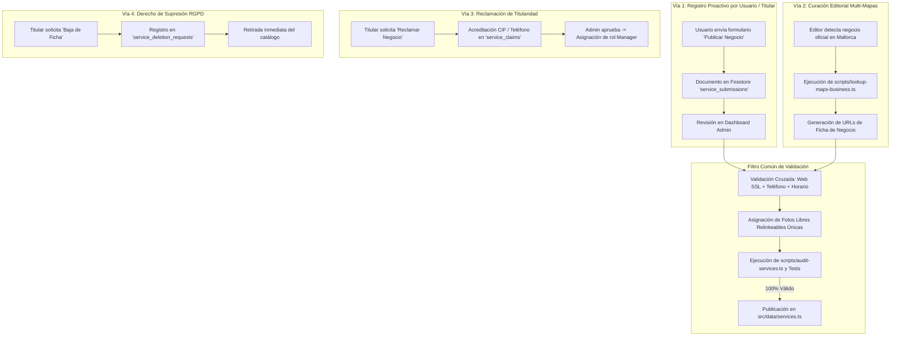

# 🏢 Proceso Oficial de Registro, Verificación y Publicación de Negocios — Servicios Mallorca

> **Guía Operativa Integral (Standard Operating Procedure)**
> Detalla paso a paso las 4 vías oficiales para registrar, verificar, reclamar o dar de baja un negocio en Servicios Mallorca, garantizando el cumplimiento de **GR-11 (Zero Fake Data)**, **GR-12 (Fidelidad Google Maps)** y **GR-13 (Seguridad & RGPD)**.

---

## 1. Mapa General de Procesos



---

## 2. Vía A: Propuesta de Nuevo Negocio por Usuarios / Titulares

Cualquier usuario registrado o propietario de una empresa en Mallorca puede postular un negocio:

1. **Envío de la Solicitud:**
   - Desde la página de directorio (`/servicios`), se pulsa el botón **"Publicar Negocio"**.
   - Se cumplimentan los campos mínimos: Nombre comercial, Categoría, Zona de Mallorca, Dirección física, Teléfono oficial, Web/Redes y Descripción del servicio.
2. **Almacenamiento Seguro:**
   - La propuesta se guarda en la colección de Firestore `service_submissions` vinculada al `applicantUid` del usuario.
   - Estado inicial: `status: "pending"`.
3. **Moderación Editorial en Panel de Control:**
   - Los administradores revisan la solicitud en `/dashboard` (Pestaña _Propuestas de Nuevos Negocios_).
   - El equipo editorial contrasta la información con Google Maps y fuentes oficiales.
4. **Aprobación o Rechazo:**
   - Si los datos son verídicos, se aprueba y se indexa en el catálogo oficial.
   - Si faltan datos o es fraudulento, se rechaza con motivo explicativo.

---

## 3. Vía B: Ingesta Editorial Proactiva (Curación por Agentes y Editores)

Para incorporar negocios proactivamente al catálogo siguiendo las normas de calidad:

### Paso 1: Búsqueda y Resolución Multi-Mapas

Ejecutar el script de resolución para generar el perfil inicial:

```bash
npx tsx scripts/lookup-maps-business.ts "Nombre Comercial" "Dirección o Municipio"
```

El script genera automáticamente:

- `googleMapsUrl`: Enlace directo a la **Ficha Comercial Oficial (Google Place Card)**: `https://www.google.com/maps/search/?api=1&query=Nombre+Direccion+Mallorca`.
- `appleMapsUrl`: Enlace a Apple Maps con query y coordenadas.
- `bingMapsUrl`: Enlace a Bing Maps.
- `coordinates`: Latitud y longitud dentro del polígono de Mallorca.
- `zone`: Asignación automática de zona (`palma`, `calvia-andratx`, `raiguer-pla`, etc.).

### Paso 2: Validación Cruzada de Datos Oficiales (Zero Fake Data)

Verificar en los canales oficiales de la empresa:

1. **Teléfono:** Prefijo español `+34 ...` verificado.
2. **Horario:** Días y franjas horarias reales de atención.
3. **Puntuación y Reseñas:** Reflejo verídico de las reseñas públicas de Google Maps.
4. **Sitio Web Oficial:** Certificado SSL activo (`https://`).

### Paso 3: Selección de Imágenes Libres Relinkeables Únicas

1. Seleccionar imágenes de alta resolución (`w=1200, q=80`) de bancos libres de derechos comerciales (Unsplash, Pexels) o recursos públicos autorizados del propio negocio.
2. **Regla de Unicidad:** Cada imagen de cabecera (`image`) y galería (`gallery`) debe ser **100% exclusiva** en todo el catálogo.

### Paso 4: Inserción en el Catálogo

Añadir el registro a `SERVICES` en [`src/data/services.ts`](file:///c:/Users/ink.enzo/Desktop/p/servicios-mallorca/src/data/services.ts) con descripciones completas y puntos fuertes en los 3 idiomas (`es`, `en`, `ca`).

---

## 4. Vía C: Reclamación y Verificación de Titularidad

Permite a los propietarios legítimos tomar el control de su ficha en Servicios Mallorca:

1. El titular accede a la ficha de su negocio en `/servicios/[slug]` y hace clic en **"Reclamar este negocio"**.
2. Rellena el formulario con:
   - CIF / Documento de acreditación de titularidad.
   - Teléfono de contacto directo del titular.
   - Correo electrónico corporativo.
3. La solicitud se almacena en la colección `service_claims` con estado `pending`.
4. El administrador valida la acreditación en `/dashboard` y aprueba la solicitud.
5. Al aprobarse:
   - El usuario obtiene rol de **Manager** sobre la ficha (`ownerUid == request.auth.uid`).
   - El titular puede actualizar horarios, teléfono de atención, fotos y servicios ofrecidos.

---

## 5. Vía D: Derecho de Supresión (Baja RGPD)

En cumplimiento de la legislación europea de protección de datos (RGPD / LOPDGDD):

1. Cualquier propietario o titular puede solicitar la baja de su ficha:
   - Mediante el botón **"Solicitar Supresión de Ficha"** en la propia ficha del servicio.
   - A través del formulario de la página de [Política de Privacidad](/es/privacidad).
   - Enviando un correo electrónico a `privacidad@serviciosmallorca.es`.
2. La solicitud se registra en `service_deletion_requests`.
3. El equipo administrativo tramita la baja en un plazo máximo de **24-48 horas laborables**, retirando la ficha de forma definitiva.

---

## 6. Pipeline de Verificación Obligatorio Pre-Despliegue

Antes de dar por completada cualquier alta de negocio, es obligatorio ejecutar la suite de control de calidad:

```bash
# 1. Verificación de tipos TypeScript
npm run typecheck

# 2. Ejecución de tests unitarios y validación anti-duplicados
npm test

# 3. Auditoría exhaustiva del catálogo y estado web
npx tsx scripts/audit-services.ts

# 4. Verificación de compilación limpia de producción
npm run build
```

El catálogo debe mantener en todo momento:

- ✅ **0 errores de TypeScript**.
- ✅ **0 IDs, nombres, slugs o imágenes duplicadas**.
- ✅ **100% de coordenadas en Mallorca**.
- ✅ **100% de enlaces de mapas dirigidos a la ficha comercial**.
