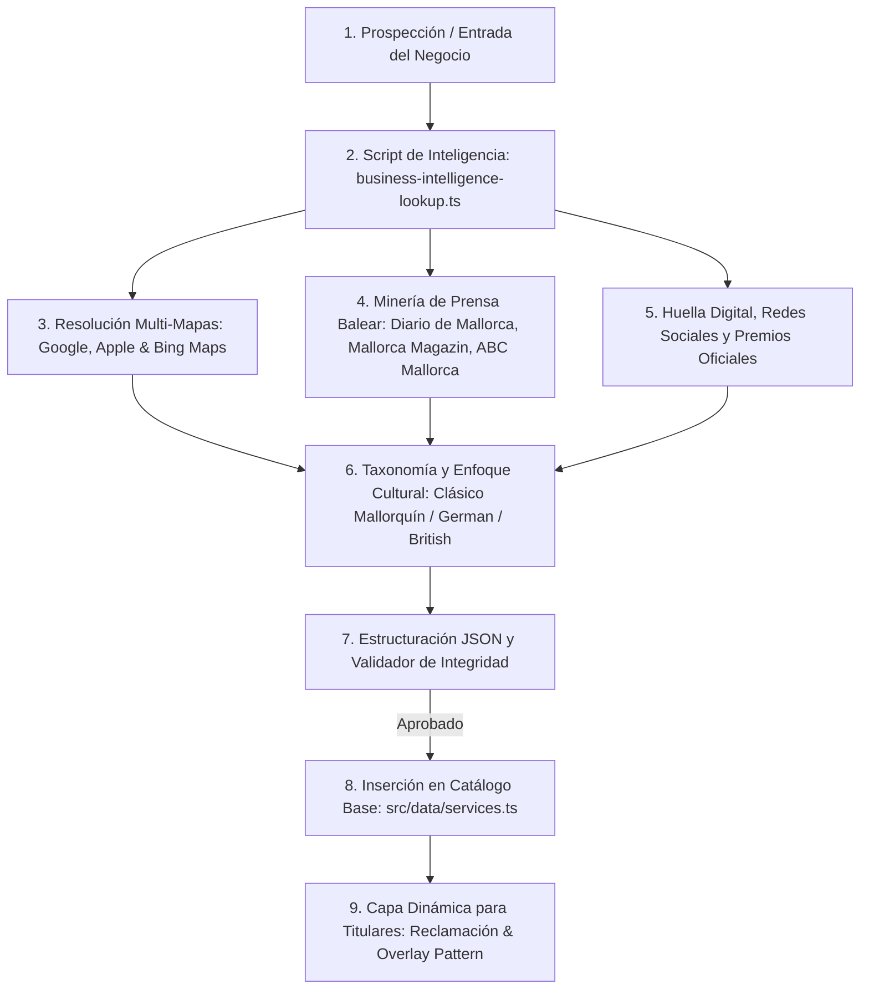

# 🔍 Protocolo de Búsqueda, Inteligencia, Curación y Registro de Negocios — Servicios Mallorca

> **Protocolo Operativo Estándar (SOP)** para la prospección, minería de datos de inteligencia, verificación cruzada, categorización cultural y registro oficial de empresas y servicios en Mallorca.
> Cumple estrictamente con las Golden Rules **GR-11 (Zero Fake Data)**, **GR-12 (Fidelidad Multi-Mapas 90%+)** y **GR-13 (Overlay Pattern & Cero Costes)**.

---

## 1. Flujo de Trabajo Integral de Búsqueda y Registro



---

## 2. Fase 1: Minería de Inteligencia y Huella Digital

Antes de crear o editar cualquier ficha, se debe ejecutar el script centralizado de inteligencia:

```bash
npx tsx scripts/business-intelligence-lookup.ts "<Nombre del Negocio> <Localidad>"
```

### Qué rastrea este script:

1. **Multi-Mapas Oficiales:** Genera los enlaces exactos de cotejo para Google Maps, Apple Maps, Bing Maps y OpenStreetMap.
2. **Prensa Balear y Medios Internacionales:** Búsquedas específicas (_Google Dorks_) en:
   - _Diario de Mallorca_ e _Última Hora_ (Prensa general balear).
   - _Mallorca Magazin_ y _Mallorca Zeitung_ (Comunidad alemana).
   - _Majorca Daily Bulletin_ (Comunidad británica y angloparlante).
   - _ABC Mallorca_ (Guía de lujo, gastronomía y estilo).
   - _IB3 Notícies_ (Información autonómica en catalán).
3. **Premios, Certificaciones y Convenciones:** Identifica si el estudio o negocio ha ganado certámenes oficiales o cuenta con certificados sanitarios/técnicos de grado médico o turístico.
4. **Perfiles Sociales Oficiales:** Detección de Instagram oficial, TikTok, TripAdvisor o Trustpilot.

---

## 3. Fase 2: Clasificación Taxonómica e Identidad Cultural

Cada negocio debe clasificarse siguiendo la taxonomía canónica ([`docs/TAXONOMY.md`](TAXONOMY.md)):

### 3.1. Asignación de Sector y Categorías

- **`category` (Principal):** Debe pertenecer a una de las categorías activas en `CATEGORIES` (`src/data/categories.ts`).
- **`secondaryCategories` (Híbridas):** Si el negocio combina varias ramas (ej. _estudio de tatuaje + galería de arte + barbería_ o _beach club + restaurante gourmet + charter náutico_).

### 3.2. Identidad Cultural y Enfoque de Audiencia (`culturalIdentity`)

- 🌴 **`mallorquin_heritage` (Clásico Mallorquín):** Negocios emblemáticos con historia en la isla (`isIconicHeritage: true`).
- 🇩🇪 **`german_oriented` (Deutsche Community):** Servicios con personal nativo alemán orientados a residentes y visitantes germanohablantes.
- 🇬🇧 **`british_oriented` (UK & English Speaking):** Orientados a la comunidad británica y angloparlante.
- 🇸🇪 **`scandinavian_oriented` (Nordic Hub):** Enfoque nórdico/escandinavo.
- 🇫🇷 **`french_oriented` (Comunidad Francófona).**
- 🌐 **`international_luxury` (Cosmopolita & High-End):** Servicios de lujo con atención multilingüe global.

### 3.3. Estacionalidad y Operativa Balear

- **`seasonality`:** `year_round` (abierto todo el año) vs `summer_season` (temporada de verano: abril–octubre).
- **`languagesSpoken`:** Idiomas reales en los que atiende el personal (`["es", "en", "de", "ca", "fr"]`).
- **Flags Operativos:** `inVillaService` (a domicilio en villas y fincas), `emergency24h` (guardias 24h).

---

## 4. Fase 3: Estructuración y Registro en el Catálogo

Toda ficha debe incorporarse al catálogo base en [`src/data/services.ts`](../src/data/services.ts) con la siguiente estructura tipada:

```typescript
export interface ServiceItem {
  id: string; // slug kebab-case único (ej. "kuyen-art-tattoo")
  slug: string;
  name: string; // Nombre comercial exacto verificado
  category: string; // ID de categoría canónica
  secondaryCategories?: string[]; // Categorías híbridas opcionales
  zone: string; // ID de MALLORCA_ZONES (ej. "palma", "calvia")
  address: string; // Dirección física completa en Mallorca
  coordinates: { lat: number; lng: number }; // Coordenadas GPS exactas
  rating: number; // Puntuación contrastada en Maps (1.0 - 5.0)
  reviewCount: number; // Número de reseñas públicas reales
  priceRange: "€" | "€€" | "€€€" | "€€€€";
  verified: boolean; // true si ha sido auditado por el equipo
  featured: boolean;
  status: "open" | "seasonal_closure" | "permanently_closed";
  seasonality?: "year_round" | "summer_season" | "winter_season";
  culturalIdentity?: CulturalIdentity;
  isIconicHeritage?: boolean; // true para clásicos de obligada visita
  targetAudience?: string[];
  languagesSpoken?: string[];
  emergency24h?: boolean;
  inVillaService?: boolean;
  features?: string[]; // ["wifi", "air_conditioning", "parking", "pmr"]
  foundedYear?: number; // Año de fundación
  founderName?: string; // Nombre del titular / creador
  founderStory?: { es?: string; en?: string; ca?: string };
  pressMentions?: PressMention[]; // Menciones en periódicos y revistas
  awards?: BusinessAward[]; // Premios oficiales y galardones
  authorityProfiles?: AuthorityProfile[]; // Enlaces a TripAdvisor, Instagram, etc.
  googleMapsUrl: string;
  appleMapsUrl: string;
  bingMapsUrl: string;
  phone: string;
  whatsapp: string;
  email: string;
  website: string;
  tags: string[]; // ["zona:palma", "idioma:de", "lujo"]
  shortDescription: { es: string; en: string; ca: string };
  fullDescription: { es: string; en: string; ca: string };
  highlights: { es: string[]; en: string[]; ca: string[] };
  servicesProvided: { es: string[]; en: string[]; ca: string[] };
  image: string; // URL de imagen real verificada o fallback automático
  gallery: string[];
  schedule: string; // Horario operativo real
  lastVerifiedAt: string; // Fecha ISO YYYY-MM-DD
}
```

---

## 5. Fase 4: Validación y Tests Automatizados

Antes de confirmar cualquier cambio, ejecutar la suite de integridad:

```bash
# 1. Typecheck estricto
npm run typecheck

# 2. Batería completa de tests unitarios (62+ tests)
npm test

# 3. Build de producción en local
npm run build
```

---

## 6. Fase 5: Capa Dinámica y Gestión por Titulares (Overlay Pattern)

Una vez publicado el negocio en el catálogo estático:

1. **Reclamación Formal:** Cualquier titular legítimo puede pulsar _"Reclamar Ficha"_ en `/servicios/[slug]` aportando su CIF/documentación.
2. **Auditoría y Aprobación:** Un administrador revisa la solicitud desde el panel de control (`/dashboard`) y asigna el rol `manager`.
3. **Edición Directa y Cero Costes:**
   - El titular verificado puede modificar horarios, teléfono, WhatsApp, web y descripción desde su panel privado.
   - Las modificaciones se guardan en `service_overrides/{slug}` en Firestore.
   - La **caché en memoria con TTL de 5 minutos** garantiza que las visitas públicas no consuman lecturas en Firebase, manteniendo el coste mensual en **0 €**.
