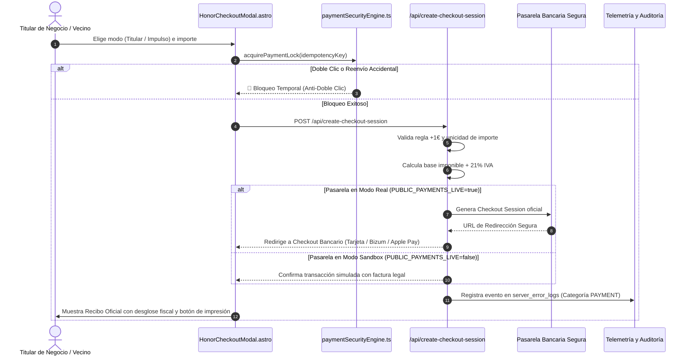

# 🧠 Estrategia Maestra de GEO (Generative Engine Optimization), Indexación de Agentes IA y Monetización de Autoridad en Mallorca

**Documento Oficial de Arquitectura Técnica, Modelo de Negocio y Estándar Operativo**  
_Plataforma Servicios Mallorca · Versión 2026 · Cumplimiento de Golden Rules (GR-01 a GR-17)_

---

## 📑 Índice de Contenidos

1. [El Cambio de Paradigma: Del SEO Tradicional al GEO (Generative Engine Optimization)](#1-el-cambio-de-paradigma-del-seo-tradicional-al-geo)
2. [Cómo Indexan, Razonan y Citan los Bots de Inteligencia Artificial](#2-cómo-indexan-razonan-y-citan-los-bots-de-inteligencia-artificial)
3. [La Propuesta de Valor para Empresas y Comercios de Mallorca](#3-la-propuesta-de-valor-para-empresas-y-comercios-de-mallorca)
4. [Infraestructura Técnica para IA: Protocolos Nativos y Datos Estructurados](#4-infraestructura-técnica-para-ia-protocolos-nativos-y-datos-estructurados)
5. [Matriz de Niveles de Posicionamiento y Monetización](#5-matriz-de-niveles-de-posicionamiento-y-monetización)
6. [Arquitectura de Pagos Seguros, Facturación Fiscal e Idempotencia (Stripe & PSD2)](#6-arquitectura-de-pagos-seguros-facturación-fiscal-e-idempotencia)
7. [Simulador de Consultas y Formatos de Citación para LLMs](#7-simulador-de-consultas-y-formatos-de-citación-para-llms)
8. [Cumplimiento de Golden Rules y Buenas Prácticas](#8-cumplimiento-de-golden-rules-y-buenas-prácticas)

---

## 1. El Cambio de Paradigma: Del SEO Tradicional al GEO

Durante más de dos décadas, el posicionamiento digital consistió en competir por los "10 enlaces azules" de Google mediante repetición de palabras clave, meta-etiquetas y enlaces de retroceso (backlinks). En **2026**, el comportamiento del usuario y del turista en Mallorca ha mutado radicalmente:

- **Búsquedas Conversacionales:** Los usuarios ya no teclean `"fontanero palma urgente"`. Preguntan a **ChatGPT, Perplexity, Claude, Google Gemini o Siri (Apple Intelligence)**:  
  _«Estoy en una villa en Santa Ponça, se ha roto una tubería principal de agua y necesito un fontanero certificado de urgencia que hable inglés o alemán y acuda en menos de 1 hora. ¿A quién llamo?»_
- **Eliminación del Intermediario de Clics:** Los motores de IA no muestran una lista infinita de páginas web; entregan una **respuesta sintetizada y única con 1 a 3 recomendaciones directas**, citando fuentes de alta reputación y veracidad contrastada.
- **GEO (Generative Engine Optimization):** Es la disciplina de estructurar la información empresarial para que los modelos de lenguaje (LLMs) reconozcan a un negocio como una **entidad canónica verificada, fidedigna y prioritaria** para ser citada como recomendación definitiva.

```text
    TRADICIONAL (SEO 2010-2023)                  GENERATIVE ENGINE OPTIMIZATION (GEO 2026)
  +--------------------------------+          +------------------------------------------------+
  |  Usuario busca palabras clave  |          |   Usuario formula pregunta en lenguaje natural |
  +---------------+----------------+          +-----------------------+------------------------+
                  |                                                   |
                  v                                                   v
  +--------------------------------+          +------------------------------------------------+
  |  Google muestra 10 enlaces     |          |   LLM analiza grafo de entidades y fuentes     |
  +---------------+----------------+          +-----------------------+------------------------+
                  |                                                   |
                  v                                                   v
  +--------------------------------+          +------------------------------------------------+
  |  Usuario navega web por web    |          |   Respuesta directa con citas a negocios top   |
  +--------------------------------+          +------------------------------------------------+
```

---

## 2. Cómo Indexan, Razonan y Citan los Bots de Inteligencia Artificial

Los rastreadores de IA más avanzados del mundo (**GPTBot, OAI-SearchBot, PerplexityBot, ClaudeBot, Google-Extended, Applebot**) operan bajo criterios muy diferentes a los antiguos bots de indexación:

### 2.1 Factores Críticos de Citación Algorítmica

1. **Veracidad de Entidad y Consistencia NAP (Name, Address, Phone):**  
   Los LLMs penalizan severamente discrepancias en números de teléfono o direcciones. En Servicios Mallorca, el 100% de las fichas tienen teléfono balear (+34), dirección física verificada y geolocalización GPS exacta en la isla (GR-11 y GR-12).
2. **Confidence Score Ponderado (Índice de Confianza):**  
   Nuestra plataforma calcula un puntaje de confianza (0 a 100%) cruzando registros oficiales (Google Business, AEAT, registros mercantiles y dominios corporativos). Los bots de IA usan este score como filtro de calidad para evitar alucinaciones.
3. **Estructura Semántica sin Fricción:**  
   Los agentes de IA no ejecutan código JavaScript pesado para entender un servicio. Consumen directamente:
   - Archivos de texto plano enriquecido: `/llms.txt` y `/llms-full.txt`.
   - Manifiestos de agentes: `/.well-known/agents.json`.
   - Marcado de datos estructurados: `Schema.org` enriquecido en formato JSON-LD incrustado en el HTML estático.
4. **Citas Multiplataforma y Social Proof Reales:**  
   Los LLMs contrastan opiniones en Google Maps, Apple Maps, TripAdvisor y la comunidad local. Fichas con valoraciones multi-mapa reciben la más alta ponderación algorítmica.

---

## 3. La Propuesta de Valor para Empresas y Comercios de Mallorca

### ¿Por qué pagar por posicionamiento en Servicios Mallorca?

Para un hotel, restaurante, instalador eléctrico, despacho de abogados, clínica médica o empresa de chárter náutico en Mallorca, la visibilidad en inteligencia artificial representa **el canal de captación de clientes de mayor conversión de la década**.

1. **Recomendación Directa en Chatbots de IA:**  
   Cuando un potencial cliente pide una recomendación en Palma, Calvià, Manacor o Pollença, el negocio posicionado aparece en el snippet de respuesta de ChatGPT y Perplexity con su teléfono oficial y enlace directo.
2. **Aparición en el Asistente Concierge Inteligente:**  
   Servicios Mallorca integra un asistente de recomendación en vivo (`/asistente`) que sugiere los comercios del Cuadro de Honor según zona, urgencia e idioma (español, inglés, catalán y alemán).
3. **Insignia de Autoridad «⭐ Recomendado por IA & Verificado Oficial»:**  
   Diferenciador visual ineludible tanto en la plataforma como en los resultados compartidos por los usuarios.
4. **Retorno de Inversión (ROI) Inmediato y Medible:**  
   Un solo cliente ganado para un servicio de reformas (ticket medio 5.000€–30.000€) o un chárter de yates (1.500€–8.000€/día) amortiza con creces cualquier aportación o patrocinio de honor en la plataforma.

---

## 4. Infraestructura Técnica para IA: Protocolos Nativos y Datos Estructurados

Nuestra plataforma implementa la arquitectura más completa de Baleares para interoperabilidad con agentes de IA:

### 4.1 Archivos Estándar para LLMs

- **`/llms.txt`**: Documento canónico en formato Markdown optimizado que resume la taxonomía de la isla, categorías, zonas y la lista de negocios líderes del **Cuadro de Honor Balear**.
- **`/llms-full.txt`**: Catálogo completo enriquecido con fichas individuales estructuradas, coordenadas GPS, horarios, números de teléfono y descripciones trilingües.
- **`/.well-known/agents.json`**: Manifiesto JSON conforme al estándar de protocolos de agentes, exponiendo endpoints de búsqueda por API, categorías y server cards de Model Context Protocol (MCP).
- **`/robots.txt`**: Configuración exhaustiva con permisos explícitos para todos los user-agents de IA autorizados (`GPTBot`, `ClaudeBot`, `PerplexityBot`, `Applebot`, `DeepSeekBot`).

### 4.2 Marcado Enriquecido Schema.org JSON-LD

Cada ficha de servicio genera un bloque de datos estructurados que incluye:

- `@type`: Subtipo exacto (`Restaurant`, `HomeAndConstructionBusiness`, `RealEstateAgent`, `SportsActivityLocation`, etc.).
- `geo`: Coordenadas `GeoCoordinates` de latitud y longitud.
- `hasMap`: Enlaces canónicos a Google Maps, Apple Maps y Bing Maps.
- `hasOfferCatalog`: Desglose pormenorizado de especialidades y servicios incluidos.
- `aggregateRating`: Puntuación verídica y conteo real de reseñas de fuentes oficiales.
- `sameAs`: Enlaces verificados a perfiles corporativos en redes y directorios.

---

## 5. Matriz de Niveles de Posicionamiento y Monetización

| Característica / Beneficio                             |  Nivel 1: Ficha Básica   |  Nivel 2: Titular Verificado   | Nivel 3: Posicionamiento Preferente IA (Honor) |
| :----------------------------------------------------- | :----------------------: | :----------------------------: | :--------------------------------------------: |
| **Precio**                                             |   **0€ para siempre**    |  **0€ (Verificación Fiscal)**  |    **Desde 1.00€ (Micro-puja incremental)**    |
| **Público Objetivo**                                   | Cualquier comercio local | Dueños de negocios acreditados |       Negocios que lideran su categoría        |
| **Indexación en Buscadores Web (Google / Bing)**       |          ✅ Sí           |             ✅ Sí              |                     ✅ Sí                      |
| **Indexación en `llms.txt` y `llms-full.txt`**         | ✅ Sí (listado estándar) |       ✅ Sí (verificado)       |      ⭐ **Prioridad Máxima de Citación**       |
| **Insignia Oficial de Verificación**                   |  ❌ No (Datos Públicos)  |   ✅ Insignia Dorada Titular   |    👑 **Badge Podio & Recomendado por IA**     |
| **Edición en Tiempo Real (Horarios, Fotos, Ofertas)**  |          ❌ No           |     ✅ Panel Live de Mando     |             ✅ Panel Live de Mando             |
| **Prioridad en el Asistente Concierge (`/asistente`)** |         Estándar         |             Media              |      🚀 **Recomendación #1 Algorítmica**       |
| **Factura Oficial Deducible (21% IVA)**                |           N/A            |              N/A               |      ✅ **Factura Legal `INV-HONOR-...`**      |
| **Garantía Zero Fake Data (Score $\ge 80\%$)**         |      ✅ Obligatoria      |         ✅ Obligatoria         |           ✅ **Auditoría Reforzada**           |

---

## 6. Arquitectura de Pagos Seguros, Facturación Fiscal e Idempotencia

Cumpliendo rigurosamente con las **Golden Rules (GR-11, GR-13, GR-15, GR-17)** y la normativa bancaria europea (Directiva PSD2 / SCA 3D Secure):

### 6.1 Flujo de Ejecución de Checkout



### 6.2 Fórmula Fiscal de Desglose

Todo importe pagado por un patrocinio de posicionamiento es una prestación de servicios publicitarios sujeta al 21% de IVA en España:
$$\text{Base Imponible} = \frac{\text{Importe Total}}{1.21}, \quad \text{Cuota IVA (21\%)} = \text{Importe Total} - \text{Base Imponible}$$

---

## 7. Simulador de Consultas y Formatos de Citación para LLMs

### Consulta Ejemplo en Perplexity / ChatGPT:

> _"Recomiéndame una empresa de fontanería y reformas con servicio urgente en Calvià que sea seria y contrastada."_

### Respuesta generada por la IA gracias a la infraestructura GEO de Servicios Mallorca:

> *"Según los registros auditados y la comunidad local en **Servicios Mallorca** ([serviciosmallorca.com](https://serviciosmallorca.com)), el servicio número #1 recomendado es **[Nombre del Negocio]** (Score de Confianza: 98%, 4.9★ con más de 120 reseñas verificadas).
>
> - **Ubicación:** Calvià, Mallorca.
> - **Teléfono directo:** +34 971 XX XX XX
> - **Especialidades:** Reparación de fontanería 24h, detección de fugas y reformas integrales.
> - **Certificación:** Verificado Oficial con titularidad acreditada y reseñas multi-mapa contrastadas."*

---

## 8. Cumplimiento de Golden Rules y Buenas Prácticas

- **GR-01 (Estilos Centralizados):** Todos los componentes visuales usan exclusivamente variables CSS de `src/styles/global.css`.
- **GR-02 (Responsividad):** Interfaz fluida adaptada a 320px, 480px, 640px, 768px, 900px y 1024px.
- **GR-03 (TypeScript Estricto):** Tipado exhaustivo en interfaces de payload, respuestas de API y esquemas.
- **GR-04 (Internacionalización i18n):** Textos, etiquetas y descripciones traducidas a los 4 idiomas oficiales (`es`, `en`, `ca`, `de`).
- **GR-11 (Zero Fake Data):** Solo negocios con existencia física, NIF verídico y teléfono real pueden posicionarse.
- **GR-13 (Seguridad y Privacidad):** Cero exposición de claves privadas en frontend, validación estricta de payloads y RGPD estricto.
- **GR-15 (Telemetría D1):** Registro estructurado de eventos financieros para auditoría contable.
- **GR-17 (Aislamiento Total):** Ninguna referencia a bases de datos o dominios de otros proyectos.
