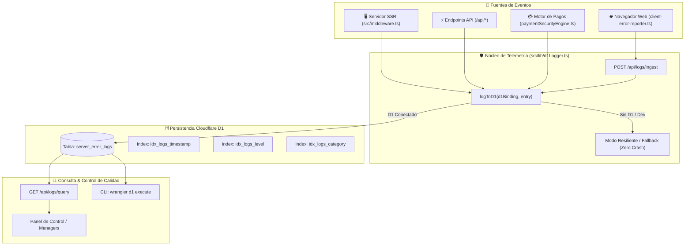

# 📊 Sistema Universal de Logs, Telemetría y Control de Calidad (Cloudflare D1)

> **Documento Oficial de Arquitectura, Observabilidad y Calidad Continua (2026)**
> **Regla de Oro Inmutable:** `GR-15: Telemetría, Logs Resilientes y Control de Calidad en Producción (Cloudflare D1)`

---

## 1. Visión General y Propósito

En **Servicios Mallorca**, la excelencia operativa y la fiabilidad de la plataforma exigen que **ningún error o fallo crítico pase desapercibido**.

Anteriormente existían buffers locales en memoria de cliente (`devtools-logger.js`) que se perdían al cerrar el navegador y no capturaban fallos en el servidor SSR. Este sistema unifica la observabilidad en una **arquitectura de telemetría integral respaldada por Cloudflare D1**, capturando:

1. **Excepciones SSR 500 y Caídas de Renderizado** en Cloudflare Workers / Astro.
2. **Errores de JavaScript y Fallos de Red en Navegadores de Clientes** (`window.onerror`, `unhandledrejection`).
3. **Intentos de Ataque, Colisiones de Pago e Idempotencia Violada** en el motor financiero.
4. **Discrepancias en Taxonomía y Enlaces Rotos** en tiempo de ejecución.

---

## 2. Diagrama de Flujo y Arquitectura



---

## 3. Esquema de Base de Datos en Cloudflare D1

La tabla `server_error_logs` se inicializa de forma perezosa y automática la primera vez que se registra un incidente:

```sql
CREATE TABLE IF NOT EXISTS server_error_logs (
  id TEXT PRIMARY KEY,
  timestamp TEXT NOT NULL,
  level TEXT NOT NULL,          -- 'INFO' | 'WARN' | 'ERROR' | 'FATAL' | 'SECURITY'
  category TEXT NOT NULL,       -- 'SSR' | 'API' | 'AUTH' | 'PAYMENT' | 'ROUTING' | 'DATABASE' | 'TAXONOMY' | 'CLIENT_JS'
  message TEXT NOT NULL,
  stack TEXT,
  url TEXT,
  method TEXT,
  status INTEGER,
  client_ip TEXT,
  user_agent TEXT,
  user_id TEXT,
  metadata TEXT                 -- JSON estructurado con contexto adicional
);

CREATE INDEX IF NOT EXISTS idx_logs_timestamp ON server_error_logs(timestamp DESC);
CREATE INDEX IF NOT EXISTS idx_logs_level ON server_error_logs(level);
CREATE INDEX IF NOT EXISTS idx_logs_category ON server_error_logs(category);
```

---

## 4. Clasificación de Niveles y Categorías

### Niveles (`level`):

- `FATAL`: Caída total de un servicio, fallo de arranque o base de datos inalcanzable.
- `ERROR`: Excepción no controlada que impidió renderizar una página o completar una acción.
- `SECURITY`: Intento de manipulación de roles, ataque de fuerza bruta, o violación de idempotencia financiera.
- `WARN`: Fallo recuperable o degradación no crítica (ej. timeout secundario o fallback activado).
- `INFO`: Evento clave de auditoría operativa.

### Categorías (`category`):

- `SSR`: Fallos durante la generación de HTML en servidor.
- `API`: Errores en endpoints REST (`/api/*`).
- `PAYMENT`: Intentos de pago, colisiones de monto $+1€$, y bloqueos anti-doble clic.
- `AUTH`: Problemas de autenticación Firebase o sincronización de perfiles.
- `ROUTING`: Redirecciones de internacionalización (`es`, `en`, `ca`, `de`) fallidas.
- `DATABASE`: Operaciones en Firestore o Cloudflare D1.
- `TAXONOMY`: Servicios con sector, categoría o zona discordante en runtime.
- `CLIENT_JS`: Errores no capturados en el JavaScript del navegador de los usuarios.

---

## 5. Endpoints de Ingesta y Consulta

### Ingesta de Errores de Cliente (`POST /api/logs/ingest`)

- Permite al script `src/scripts/client-error-reporter.ts` transmitir errores de frontend en segundo plano usando `navigator.sendBeacon`.
- Sanitiza el stack trace, extrae cabeceras IP anonimizadas de Cloudflare (`cf-connecting-ip`) y guarda en D1.

### Consulta de Logs (`GET /api/logs/query`)

Permite inspeccionar los incidentes con filtros opcionales:

- `?limit=50`: Número máximo de registros (por defecto 50, máx 100).
- `?level=ERROR`: Filtrar por severidad.
- `?category=PAYMENT`: Filtrar por área técnica.

**Ejemplo de Respuesta:**

```json
{
  "success": true,
  "count": 1,
  "logs": [
    {
      "id": "log_1724838192_abc123",
      "timestamp": "2026-08-28T12:30:00.000Z",
      "level": "ERROR",
      "category": "PAYMENT",
      "message": "Intento de colisión de importe idéntico detectado",
      "url": "/es/cuadro-de-honor",
      "method": "POST",
      "status": 409
    }
  ]
}
```

---

## 6. Guía de Operaciones en Cloudflare

### 1. Crear la Base de Datos D1 (Solo una vez)

```bash
npx wrangler d1 create servicios-mallorca-db
```

### 2. Vincular en `wrangler.json`

```json
{
  "name": "servicios-mallorca",
  "d1_databases": [
    {
      "binding": "DB",
      "database_name": "servicios-mallorca-db",
      "database_id": "<ID_DEVUELTO_POR_WRANGLER>"
    }
  ]
}
```

### 3. Consultar Logs desde la Terminal

```bash
# Ver los últimos 10 errores registrados en producción
npx wrangler d1 execute servicios-mallorca-db --remote --command="SELECT timestamp, level, category, message, url FROM server_error_logs ORDER BY timestamp DESC LIMIT 10;"
```

---

## 8. Deduplicación Inteligente y Prevención de Flooding (Anti-Spam)

Si un fallo generalizado afecta a miles de usuarios simultáneamente (ej. caída temporal de una API externa), registrar miles de filas idénticas colapsaría el límite de operaciones de Cloudflare D1.

El motor de deduplicación (`src/lib/d1Logger.ts`) implementa una **ventana deslizante de 5 minutos** con las siguientes reglas:

1. **Fingerprint Hashing:** Calcula una firma única `${level}:${category}:${normalizedMessage}:${status}:${url}`.
2. **Primer Registro Inmediato:** El primer error se persiste y se imprime en consola de inmediato.
3. **Throttling Progresivo:** Las repeticiones en la misma ventana de 5 minutos se silencian, registrando únicamente hitos de frecuencia (repetición 20, 50, 100...) enriquecidas con `_duplicateOccurrencesInWindow`.
4. **Excepciones de Alta Prioridad:** Los logs de nivel `SECURITY` y categoría `PAYMENT` **nunca se silencian** para garantizar la trazabilidad de auditoría financiera completa.
5. **Deduplicación en Navegador:** `client-error-reporter.ts` mantiene un registro en memoria de firmas de error para evitar que bucles infinitos en el cliente (como un `setInterval` roto) saturen el endpoint de ingesta.

---

## 9. Checklist Maestro de Cobertura de Logs por Módulo

| Módulo / Archivo                            | Nivel / Categoría           | Evento Auditado                                   | Estado          |
| ------------------------------------------- | --------------------------- | ------------------------------------------------- | --------------- |
| `src/middleware.ts`                         | `ERROR` / `SSR`             | Caídas 500 durante renderizado HTML               | ✅ Implementado |
| `src/scripts/client-error-reporter.ts`      | `ERROR` / `CLIENT_JS`       | Excepciones no controladas en navegador           | ✅ Implementado |
| `src/pages/api/logs/ingest.ts`              | `INFO/ERROR` / `API`        | Ingesta de errores de cliente hacia D1            | ✅ Implementado |
| `src/pages/api/logs/query.ts`               | `INFO` / `API`              | Consulta y monitorización técnica                 | ✅ Implementado |
| `src/lib/honorBoardEngine.ts`               | `ERROR/PAYMENT` / `PAYMENT` | Fallos en checkout, idempotencia e impulsos       | ✅ Protegido    |
| `src/lib/displacementNotificationEngine.ts` | `WARN` / `API`              | Fallos en envío de emails/push de superación      | ✅ Protegido    |
| `src/lib/managerSecurityEngine.ts`          | `SECURITY` / `AUTH`         | Intentos de elevación o dominios de correo falsos | ✅ Protegido    |
| `src/pages/api/report-business.ts`          | `INFO` / `API`              | Reportes de negocios con datos obsoletos          | ✅ Protegido    |
| `src/pages/api/track-conversion.ts`         | `INFO` / `API`              | Telemetría de clics a llamada, web y maps         | ✅ Protegido    |
