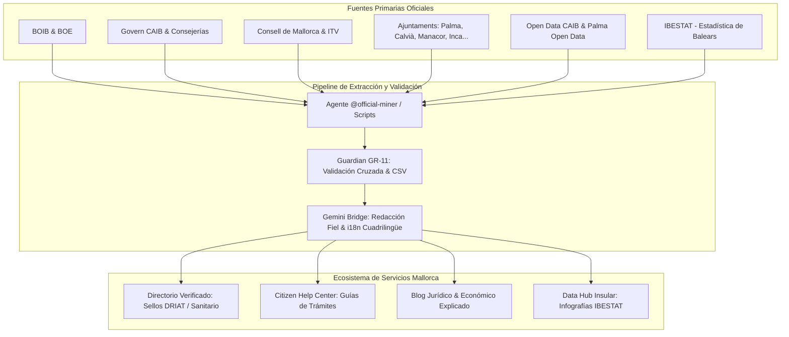

# 🏛️ Inteligencia Oficial, Guías al Ciudadano y Fuentes Institucionales de Mallorca

> **Norma de Referencia:** Alineado estrictamente con [GOLDEN_RULES.md](GOLDEN_RULES.md) (especialmente **GR-11: Veracidad y Contraste**, **GR-12: Fidelidad de Datos** y **GR-13: Seguridad y RGPD**).

---

## 1. Visión General y Propósito

El objetivo de esta infraestructura técnica y documental es consolidar a **Servicios Mallorca** como el portal de referencia insular de mayor autoridad, utilidad y rigor para ciudadanos locales, nuevos residentes, expatriados y empresas de Mallorca.

La plataforma elimina cualquier información no verificada mediante un protocolo de ingesta y contraste fundamentado en **fuentes 100% públicas, oficiales y trazables**:

1. **Directorio Oficial Enriquecido:** Contrastación de licencias de actividad, registros turísticos del Consell (DRIAT/ETV), registros sanitarios (Ib-Salut/REGEPA) y colegios oficiales.
2. **Citizen Help Center (Guías Paso a Paso):** Tramitación clara de gestiones cotidianas (padrón, tarjeta ciudadana, ITV, TSI, extranjería, deducciones fiscales).
3. **Blog de Actualidad Jurídica y Económica:** Traducción de decretos, leyes del BOIB y ordenanzas municipales a guías prácticas en 4 idiomas (ES, CA, EN, DE).
4. **Data & Stats Hub:** Indicadores clave en tiempo real y series estadísticas oficiales de IBESTAT y portales Open Data.



---

## 2. Directorio Exhaustivo de Fuentes Oficiales de Mallorca

### 2.1. Boletines y Administraciones Autonómicas

| Organismo                                            | Portal / Sede                                         | Tipo de Información Clave                                                                                     | Frecuencia de Rastreo  | Protocolo de Ingesta                              |
| ---------------------------------------------------- | ----------------------------------------------------- | ------------------------------------------------------------------------------------------------------------- | ---------------------- | ------------------------------------------------- |
| **BOIB (Boletí Oficial de les Illes Balears)**       | [caib.es/eboibfront](https://www.caib.es/eboibfront/) | Leyes autonómicas, decretos, resoluciones de zonificación, licencias, subvenciones oficiales y convocatorias. | Diario (Mar, Jue, Sáb) | Scraping RSS sumario y parseo de PDFs de decretos |
| **Govern de les Illes Balears (CAIB)**               | [caib.es](https://www.caib.es)                        | Notas de prensa del Govern, consejerías, trámites en Sede Electrónica.                                        | Diario                 | Feed RSS institucional y comunicados de prensa    |
| **Conselleria de Salut (Ib-Salut)**                  | [ibsalut.es](https://www.ibsalut.es)                  | Centros de salud (PAC), hospitales de referencia, farmacias de guardia, campañas de salud pública.            | Semanal                | Dataset farmacias + Sede Ib-Salut                 |
| **Conselleria de Turisme, Cultura i Esports**        | [turisme.caib.es](https://turisme.caib.es)            | Registro General de Empresas y Actividades Turísticas (DRIAT / ETV), inspección turística y normativas.       | Quincenal              | Portal de Transparència y resoluciones DRIAT      |
| **IBAVI (Institut Balear de l'Habitatge)**           | [ibavi.caib.es](https://ibavi.caib.es)                | Ayudas al alquiler, parque de vivienda protegida, índice de precios de alquiler, cédulas de habitabilidad.    | Semanal                | Tablón oficial y portal de vivienda               |
| **Conselleria d'Empresa, Ocupació i Energia (SOIB)** | [soib.es](https://soib.es)                            | Ofertas de empleo público, ayudas a autónomos, formación profesional ocupacional, observatorio de empleo.     | Diario                 | Portal SOIB y boletines de empleo                 |
| **Agència Tributària de les Illes Balears (ATIB)**   | [atib.es](https://www.atib.es)                        | Calendario fiscal balear, ITP (Transmisiones), tributos propios, bonificaciones fiscales y sucesiones.        | Mensual                | Calendario fiscal y normativas tributarias        |

---

### 2.2. Administración Insular: Consell de Mallorca

| Departamento                                       | Portal Oficial                                                                         | Competencias e Información Obtenible                                                                                                            | Enlace Operativo            |
| -------------------------------------------------- | -------------------------------------------------------------------------------------- | ----------------------------------------------------------------------------------------------------------------------------------------------- | --------------------------- |
| **Sede Central Consell de Mallorca**               | [conselldemallorca.cat](https://www.conselldemallorca.cat)                             | Ordenación territorial insular, patrimonio histórico, servicios sociales, concesiones insulares.                                                | Sede electrónica            |
| **ITV Mallorca (Inspección Técnica de Vehículos)** | [serviciositv.conselldemallorca.cat](https://serviciositv.conselldemallorca.cat)       | Citas previas en las 5 estaciones (Palma I Can Valero, Palma II Son Castelló, Inca, Manacor, Calvià), tasas oficiales e instrucciones técnicas. | Plataforma cita previa ITV  |
| **Departament de Carreteres i Infraestructures**   | [visorcarreteres.conselldemallorca.cat](https://visorcarreteres.conselldemallorca.cat) | Estado de carreteras insulares en tiempo real, cortes por obras o eventos, radares y restricciones.                                             | Visor geográfico de tráfico |
| **Departament de Turisme del Consell**             | [mallorca.es](https://www.mallorca.es)                                                 | Gestión y sanciones de licencias de alquiler turístico en Mallorca (ETV), campañas oficiales de promoción sostenible.                           | Registro insular de turismo |
| **Departament de Sostenibilitat i Medi Ambient**   | [conselldemallorca.cat/medi-ambient](https://conselldemallorca.cat/medi-ambient)       | Refugios de la Ruta de Pedra en Sec (GR-221), fincas públicas (Galatzó, Raixa), senderos homologados.                                           | Red de refugios y reservas  |

---

### 2.3. Principales Ayuntamientos y Entidades Municipales

| Municipio                                                              | Sede / Portal                                            | Áreas Clave para Ciudadanos y Negocios                                                                          | Servicios Conectados                         |
| ---------------------------------------------------------------------- | -------------------------------------------------------- | --------------------------------------------------------------------------------------------------------------- | -------------------------------------------- |
| **Ajuntament de Palma**                                                | [palma.cat](https://www.palma.cat)                       | Padrón, Tarjeta Ciudadana, OACs, licencias de obras/actividad, Policía Local, ZAS, recogida de residuos.        | 9 Oficinas de Atención a la Ciudadanía (OAC) |
| **EMT Palma**                                                          | [emtpalma.cat](https://www.emtpalma.cat)                 | Red de buses urbanos: tarifas, líneas a aeropuerto (A1, A2), tarjeta ciudadana y desvíos.                       | API tiempo real de paso                      |
| **SMAP Palma**                                                         | [aparcamentspalma.cat](https://www.aparcamentspalma.cat) | Parkings públicos subterráneos (Marquès de la Sènia, Vía Roma, Sa Gerreria...), BiciPalma.                      | API plazas libres en tiempo real             |
| **EMAYA**                                                              | [emaya.es](https://www.emaya.es)                         | Ciclo integral del agua, recogida de residuos voluminosos, puntos verdes fijos y móviles.                       | Teléfono citas voluminosos 900 724 000       |
| **Ajuntament de Calvià**                                               | [calvia.com](https://www.calvia.com)                     | Trámites municipales para Calvià Vila, Magaluf, Palmanova, Santa Ponça, Peguera. OMACs y ordenanzas turísticas. | Sede electrónica Calvià                      |
| **Ajuntament de Manacor**                                              | [manacor.org](https://www.manacor.org)                   | Servicios comarcales del Llevant, policía local, ordenanzas de Porto Cristo, licencias comerciales.             | OAC Manacor y Porto Cristo                   |
| **Ajuntament d'Inca**                                                  | [inca.cat](https://www.inca.cat)                         | Servicios de la comarca del Raiguer, Dijous Bo, mercado semanal, licencias en polígonos industriales.           | Sede electrónica Inca                        |
| **Ajuntament d'Alcúdia**                                               | [alcudia.net](https://www.alcudia.net)                   | Normativas portuarias, ordenanzas de playas, licencias de hostelería del Port d'Alcúdia.                        | OMAC Alcúdia                                 |
| **Llucmajor, Marratxí, Felanitx, Pollença, Andratx, Santanyí, Sóller** | Portales municipales                                     | Citas de padrón, IBI, vados y ordenanzas locales de terrazas y ruidos.                                          | Sedes electrónicas municipales               |

---

### 2.4. Datos Abiertos y Estadísticas (Data Hub)

| Fuente de Datos                                           | Endpoint / Portal                                      | Datasets y Formatos Disponibles                                                                                   | Uso en la Plataforma                                   |
| --------------------------------------------------------- | ------------------------------------------------------ | ----------------------------------------------------------------------------------------------------------------- | ------------------------------------------------------ |
| **IBESTAT (Institut d'Estadística de les Illes Balears)** | [ibestat.caib.es](https://ibestat.caib.es)             | API / CSV / Excel: Demografía, FRONTUR/EGATUR Baleares, EPA balear, IPC insular, empresas registradas.            | Paneles de datos y tendencias económicas del blog      |
| **Dades Obertes CAIB**                                    | [dadesobertes.caib.es](https://dadesobertes.caib.es)   | API CKAN v3 (JSON/GeoJSON): Farmacias de guardia, equipamientos públicos, playas bandera azul, puntos recarga EV. | Ingesta directa en catálogo y mapas interactivos       |
| **Palma Open Data**                                       | [opendata.palma.cat](https://opendata.palma.cat)       | REST API (JSON): Ocupación de parkings en directo, paradas EMT, desfibriladores (DEA), contenedores y callejero.  | Widgets dinámicos de utilidad pública                  |
| **TIB (Transports de les Illes Balears)**                 | [tib.org](https://www.tib.org)                         | GTFS estático y feeds de líneas de bus TIB, tren (SFM) y metro. Rutas Aerotib y tarifas intermodales.             | Guías de transporte y movilidad sostenible             |
| **Instituto Geográfico Nacional (IGN) & Catastro**        | [sedecatastro.gob.es](https://www.sedecatastro.gob.es) | WMS / Consulta de referencia catastral por coordenadas.                                                           | Verificación de referencias catastrales y localización |

---

### 2.5. Registros Oficiales y Colegios Profesionales

Conforme a **GR-11** (Zero Fake Data), la plataforma corrobora las credenciales profesionales:

1. **COMIB (Col·legi Oficial de Metges de les Illes Balears - [comib.com](https://www.comib.com)):**
   - Validación de número de colegiado médico y especialidad médica oficial.
2. **ICAIB (Il·lustre Col·legi d'Advocats de les Illes Balears - [icaib.org](https://www.icaib.org)):**
   - Búsqueda en el censo público de abogados ejercientes colegiados en Palma, Inca o Manacor.
3. **COFIB (Col·legi Oficial de Farmacèutics de les Illes Balears - [cofib.es](https://www.cofib.es)):**
   - Calendario oficial y turnos de guardia obligatorios de farmacias en toda la isla.
4. **COAIB (Col·legi Oficial d'Arquitectes de les Illes Balears - [coaib.org](https://www.coaib.org)):**
   - Verificación de arquitectos colegiados y registro de cédulas de habitabilidad y visados.
5. **CAFBAL (Col·legi d'Administradors de Finques de Balears - [cafbal.com](https://www.cafbal.com)):**
   - Verificación de administradores titulados para comunidades de propietarios.
6. **Registro Mercantil de Palma de Mallorca / BORME:**
   - Comprobación de NIF, razón social, fecha de constitución y objeto social.
7. **Registro de Establecimientos Sanitarios (REGEPA / RES Baleares):**
   - Homologación de centros médicos, clínicas dentales, fisioterapia y clínicas veterinarias.

---

### 2.6. Seguridad, Emergencias y Servicios Críticos

| Servicio                                 | Teléfono Gratuito / Directo                          | Cobertura Territorial                                                        | Idiomas de Atención                          |
| ---------------------------------------- | ---------------------------------------------------- | ---------------------------------------------------------------------------- | -------------------------------------------- |
| **Emergencias 112 Illes Balears**        | `112`                                                | Todo el archipiélago balear                                                  | Castellano, Catalán, Inglés, Alemán, Francés |
| **SAMU 061 (Urgencias Médicas)**         | `061`                                                | Emergencias vitales y ambulancias medicalizadas                              | Multilingüe                                  |
| **Bombers de Mallorca (Consell)**        | `112` / `085`                                        | 8 parques: Calvià, Inca, Manacor, Sóller, Felanitx, Alcúdia, Llucmajor, Artà | ES, CA, EN                                   |
| **Bombers de Palma**                     | `080`                                                | Término municipal de Palma                                                   | ES, CA                                       |
| **Policía Local Palma**                  | `092` / `+34 971 22 55 00`                           | Palma, Platja de Palma, Son Sardina, Establiments                            | ES, CA, EN, DE                               |
| **IBANAT (Incendios Forestales)**        | `900 180 180` / `112`                                | Serra de Tramuntana, Parques Naturales de Mallorca                           | ES, CA                                       |
| **Salvamento Marítimo Palma**            | `900 202 202` / `+34 971 72 45 62`                   | Aguas marítimas de Mallorca y Cabrera                                        | ES, EN                                       |
| **AENA Aeropuerto Son Sant Joan (PMI)**  | `+34 91 321 10 00`                                   | Operaciones de vuelo y asistencia PMR                                        | Multilingüe                                  |
| **Autoritat Portuària de Balears (APB)** | [portsdebalears.com](https://www.portsdebalears.com) | Puertos de Palma y Alcúdia                                                   | ES, CA, EN                                   |

---

## 3. Matriz de Competencias: Guía Rápida para el Ciudadano

Para evitar extravíos burocráticos, Servicios Mallorca ofrece una guía de competencias clara:

```
┌────────────────────────────────────────────────────────────────────────┐
│                        ESTADO (Gobierno de España)                     │
│  • Extranjería y Fronteras: NIE, TIE, Pasaportes, Asilo (Policía Nac.) │
│  • Seguridad Social (INSS) y Prestaciones por Desempleo (SEPE)         │
│  • Dominio Público Marítimo-Terrestre (Costas)                         │
│  • Aeropuertos (AENA) y Puertos Comerciales de Interés General (APB)  │
├────────────────────────────────────────────────────────────────────────┤
│                   GOVERN DE LES ILLES BALEARS (CAIB)                   │
│  • Sanidad: Tarjeta Sanitaria (TSI), Hospitales y Centros PAC (Ib-Salut)│
│  • Educación: Escolarización, Guarderías, Formación y Universidad UIB  │
│  • Vivienda: IBAVI, Cédulas de Habitabilidad, Ayudas al Alquiler       │
│  • Tributos Autonómicos: ATIB (ITP transmisiones, Sucesiones, Canon)   │
│  • Empleo y Formación Profesional: SOIB                                │
├────────────────────────────────────────────────────────────────────────┤
│                       CONSELL INSULAR DE MALLORCA                      │
│  • Inspección Técnica de Vehículos (ITV Mallorca: 5 estaciones)        │
│  • Red de Carreteras y Accesos de la Isla                              │
│  • Ordenación Turística Insular: Licencias ETV, DRIAT e Inspección     │
│  • Gestión de Residuos Insulares (TIRME) y Protección de la Tramuntana │
├────────────────────────────────────────────────────────────────────────┤
│                        AYUNTAMIENTOS LOCALES                           │
│  • Padrón Municipal de Habitantes (Alta, Modificación y Volante)       │
│  • Tarjeta Ciudadana (Transporte urbano EMT, BiciPalma, IME Deportes)  │
│  • Licencias Urbanísticas: Obras menores, obras mayores, actividad     │
│  • Tributos Municipales: IBI, Impuesto de Circulación (IVTM), Basuras  │
│  • Convivencia y Vía Pública: Ordenanzas de Ruidos, ZAS, Terrazas      │
└────────────────────────────────────────────────────────────────────────┘
```

---

## 4. Fichas Operativas de Trámites Ciudadanos (Citizen Help Center)

A continuación se detalla la estructura canónica de las 6 guías oficiales prioritarias a publicar:

---

### Guía Oficial 1: Empadronamiento en Palma y Municipios de Mallorca

```markdown
# 📋 Guía Oficial: Cómo Empadronarse en Mallorca (Padrón Municipal)

## ¿Quién debe tramitarlo?

Toda persona que resida habitualmente en Mallorca, sea española o extranjera. El empadronamiento es el documento fundacional necesario para: tarjeta ciudadana, tarjeta sanitaria del Ib-Salut, escolarización de hijos y descuento del 75% en vuelos/barcos.

## Documentación Requerida (Checklist Oficial):

1. **Documento de Identidad Original en Vigor:**
   - Ciudadanos españoles: DNI o Pasaporte.
   - Ciudadanos UE: Pasaporte o documento de identidad de su país + Certificado de Registro de Ciudadano de la Unión (NIE verde).
   - Ciudadanos no comunitarios: Tarjeta de Identidad de Extranjero (TIE) o Pasaporte en vigor.
2. **Acreditación de la Vivienda:**
   - **Propietario:** Escritura de compraventa original, nota simple del Registro de la Propiedad (últimos 3 meses) o último recibo del IBI a su nombre.
   - **Inquilino:** Contrato de arrendamiento en vigor (mínimo 6 meses) con justificante del depósito de fianza en el IBAVI + último recibo de alquiler o recibo de suministro (luz/agua).
   - **Si vive en casa de otra persona empadronada:** Autorización escrita del titular firmada + copia del DNI del titular + documento de propiedad o alquiler.

## Modalidades de Tramitación:

- **Presencial con Cita Previa:**
  - Palma: OAC Cort, OAC San Fernando, OAC Pere Garau, OAC S'Escorxador, OAC Avingudes.
  - Cita en línea: [palma.cat/cita-previa](https://palma.cat) o teléfono 010.
- **Telemática:** En la Sede Electrónica del Ajuntament mediante Certificado Digital, DNI electrónico o Cl@ve.

## Tasas: Gratuito (0,00 €).

## Vigencia: Permanente para comunitarios/españoles. Renovación cada 2 años para extranjeros no comunitarios sin residencia de larga duración.
```

---

### Guía Oficial 2: Tarjeta Ciudadana de Palma (EMT y Servicios Municipales)

```markdown
# 💳 Guía Oficial: Tarjeta Ciudadana de Palma (Bonos y Beneficios)

## ¿Qué es?

Tarjeta personal e intransferible para vecinos empadronados en Palma que permite acceder a descuentos y gratuidades en los servicios públicos municipales.

## Beneficios Clave:

- **Autobuses EMT Palma:** Trayectos gratuitos o con tarifas ultrarreducidas según perfil.
- **BiciPalma:** Tarifas preferentes de abono anual al servicio público de bicicletas.
- **Aparcamientos SMAP:** Descuento en la red de parkings municipales y pago automatizado.
- **Institut Municipal de l'Esport (IME):** Acceso bonificado a piscinas municipales (Son Hugo, Son Moix, Germans Escalas) y polideportivos.
- **Bibliotecas Municipales:** Carnet único de préstamo bibliotecario de la red de Palma.

## Perfiles Oficiales:

- **Residente General:** Tarifa bonificada en EMT.
- **Menores (hasta 16 años):** Transporte gratuito en EMT.
- **Estudiantes y Jóvenes (17 a 30 años):** Descuentos especiales para estudiantes.
- **Jubilados / Pensionistas (Perfil Carnet Gran):** Tarifa Cero o bonificación máxima.
- **Personas en Situación de Desempleo:** Perfil social bonificado.

## Dónde y Cómo Solicitarla:

- Inmediata en cualquier oficina OAC con DNI/NIE en vigor y fotografía (si no figura en base de datos).
- Solicitud telemática en [palma.cat](https://palma.cat) con envío a domicilio.
```

---

### Guía Oficial 3: Descuento de Residente Balear del 75% en Viajes

```markdown
# ✈️ Guía Oficial: Descuento de Residente Balear (75% en Vuelos y Ferries)

## ¿En qué consiste?

Bonificación del 75% sobre las tarifas base de pasajes de transporte regular aéreo y marítimo entre las Illes Balears y la Península, así como en trayectos interislas (Mallorca ⇄ Menorca ⇄ Ibiza ⇄ Formentera), subvencionado por el Ministerio de Transportes.

## ¿Quién tiene derecho?

- Ciudadanos españoles empadronados en cualquier municipio de Mallorca.
- Ciudadanos de Estados miembros de la Unión Europea o del EEE / Suiza, residentes en Mallorca y en posesión del Certificado de Registro UE.
- Familiares extracomunitarios con tarjeta de residencia comunitaria en vigor.

## Verificación Automática (Sistema SARA):

- En el 95% de los casos, la validación se realiza en tiempo real durante la compra en la web de la aerolínea o naviera mediante el sistema de comprobación telemática del Ministerio (SARA).
- **Si el sistema SARA da error:**
  1. Acceder a la sede electrónica de su Ayuntamiento (ej: [palma.cat](https://palma.cat)) y descargar el **Certificado de Empadronamiento para Viajes** (con Código Seguro de Verificación - CSV).
  2. También disponible al instante en los cajeros automáticos municipales con DNI o Tarjeta Ciudadana.
  3. Presentar dicho certificado impreso o digital junto con el DNI/NIE en la puerta de embarque.
```

---

### Guía Oficial 4: Cita Previa e Inspección Técnica de Vehículos (ITV Mallorca)

```markdown
# 🚗 Guía Oficial: ITV Mallorca (Estaciones, Cita Previa y Tasas)

## Estaciones Oficiales del Consell de Mallorca:

1. **Palma I (Can Valero):** Camí dels Reis, s/n (Polígon Can Valero).
2. **Palma II (Son Castelló):** Carrer Gremi Menestrals, 18 (Polígon Son Castelló).
3. **Inca:** Polígon Industrial Can Matzarí.
4. **Manacor:** Carretera Palma-Manacor, km 48.
5. **Calvià (Magaluf):** Camí de Cala Figuera.

## Cómo Pedir Cita Previa Oficial:

- Web oficial única y sin intermediarios: [serviciositv.conselldemallorca.cat](https://serviciositv.conselldemallorca.cat).
- Teléfono oficial de cita del Consell: **971 17 08 00**.
- **¡Alerta antifraude!** Desconfiar de portales de terceros que cobran comisiones de gestión suplementarias.

## Documentación a Presentar el Día de la Cita:

1. Permiso de Circulación original del vehículo.
2. Ficha Técnica original (Tarjeta ITV) en formato papel o electrónica (e-ITV).
3. Acreditación del Seguro Obligatorio en vigor (la estación lo corrobora telemáticamente con el FIVA).
4. DNI de la persona que presenta el vehículo (no es obligatorio que sea el propietario).

## Procedimiento si la Inspección es Desfavorable:

- Se dispone de un plazo legal máximo de **60 días naturales** para subsanar los defectos graves en un taller mecánico y volver a presentar el vehículo a una segunda inspección.
```

---

### Guía Oficial 5: Tarjeta Sanitaria Individual (TSI) del Ib-Salut

```markdown
# 🏥 Guía Oficial: Cómo Obtener la Tarjeta Sanitaria del Ib-Salut en Mallorca

## ¿Para qué sirve?

Es el documento público que acredita el derecho a la asistencia médica del Sistema Sanitario Público de las Illes Balears (Servei de Salut) y permite la prescripción de recetas médicas electrónicas en cualquier farmacia.

## Requisitos Previos Indispensables:

1. Estar empadronado en un municipio de Mallorca.
2. Tener reconocido el derecho a la asistencia sanitaria por el Instituto Nacional de la Seguridad Social (INSS) como trabajador en activo, pensionista, beneficiario o persona sin recursos suficientes.

## Procedimiento de Solicitud:

1. **Presencial:** Acudir al Centro de Salud (PAC) que le corresponda por su domicilio con:
   - Certificado de empadronamiento histórico/colectivo reciente (menos de 3 meses).
   - Documento de identidad (DNI/NIE/Pasaporte).
   - Documento acreditativo de afiliación a la Seguridad Social (documento de derecho del INSS).
2. **Telemática:** A través de la Sede Electrónica del Govern CAIB o el portal [ibsalut.es](https://www.ibsalut.es) con Certificado Digital o Cl@ve.
3. Se asignará inmediatamente un médico de medicina de familia y, en su caso, pediatra de referencia.
```

---

### Guía Oficial 6: Trámites de Extranjería / Expats (NIE, TIE y Certificado UE)

```markdown
# 🌍 Guía Oficial: NIE, Certificado UE y TIE en Palma de Mallorca

## Distinción Crucial de Documentos:

1. **NIE (Número de Identidad de Extranjero):** Número personal, único y secuencial asignado a todo extranjero por razones económicas, profesionales o sociales. No autoriza la residencia por sí mismo.
2. **Certificado de Registro de Ciudadano de la Unión (Hoja Verde UE):** Obligatorio para ciudadanos de la UE/EEE que permanezcan en España más de 3 meses. Acredita residencia legal.
3. **TIE (Tarjeta de Identidad de Extranjero):** Tarjeta plástica con fotografía y huella para ciudadanos de fuera de la Unión Europea (extracomunitarios).

## Oficinas Oficiales en Mallorca:

- **Oficina Única de Extranjería en Palma:** Carrer de Felicià Fuster, 7, 07006 Palma.
- **Comisaría de Policía Nacional Palma - Doria:** Carrer de Simó Ballester, 8.
- **Comisarías comarcales:** Manacor (C/ San Francesc) e Inca.

## Cita Previa Obligatoria:

- Portal oficial de la Secretaría de Estado de Administraciones Públicas: `sede.administracionespublicas.gob.es` ➔ Seleccionar provincia "Illes Balears".
```

---

## 5. Arquitectura Técnica y Schemas TypeScript

Para garantizar el cumplimiento de **GR-03** (TypeScript estricto) y **GR-11** (Zero Fake Data), se definen los siguientes modelos de datos tipados para enriquecer el repositorio:

### 5.1. Metadatos de Fuentes Oficiales

```typescript
export type OfficialEntity =
  | "Govern CAIB"
  | "Consell de Mallorca"
  | "Ajuntament de Palma"
  | "Ajuntament de Calvià"
  | "Ajuntament de Manacor"
  | "Ajuntament d'Inca"
  | "IBESTAT"
  | "BOIB"
  | "BOE / Ministerio"
  | "Ports de Balears"
  | "AENA";

export type VerificationConfidenceLevel =
  | "official-boletin" // Procedente directamente del BOIB / BOE
  | "open-data-api" // Dataset público validado por API oficial
  | "institutional-portal" // Sede electrónica institucional verificada
  | "official-press-release"; // Nota de prensa o rueda de prensa del Govern/Consell

export interface OfficialSourceMetadata {
  officialEntity: OfficialEntity;
  sourceUrl: string;
  officialReferenceId?: string; // Ej: "Decreto Ley 3/2026" o "BOIB Núm. 112/2026"
  officialLastUpdated: string; // Formato ISO YYYY-MM-DD
  verificationLevel: VerificationConfidenceLevel;
  jurisdiction: "Mallorca" | "Palma" | "Calvià" | "Inca" | "Manacor" | "Illes Balears";
  digitalSignatureCsv?: string; // Código Seguro de Verificación oficial si aplica
}
```

### 5.2. Modelo de Guía Ciudadana (`CitizenGuideItem`)

```typescript
export interface ProcessingOffice {
  name: string;
  address: string;
  zone: string;
  phone?: string;
  appointmentUrl?: string;
  coordinates?: { lat: number; lng: number };
}

export interface CitizenGuideItem {
  id: string;
  slug: string;
  title: { es: string; en: string; ca: string; de: string };
  summary: { es: string; en: string; ca: string; de: string };
  category: "padron" | "transporte" | "salud" | "extranjeria" | "vehiculos" | "vivienda" | "tributos";
  targetAudience: Array<"residentes" | "nuevos_residentes" | "expats" | "autonomos" | "familias">;
  officialSource: OfficialSourceMetadata;
  feeAmount: number; // 0 si es gratuito
  feeCurrency: "EUR";
  processingTimeDays?: number;
  validityYears?: number;
  requiredDocuments: Array<{
    name: { es: string; en: string; ca: string; de: string };
    isMandatory: boolean;
    notes?: { es: string; en: string; ca: string; de: string };
  }>;
  stepByStepGuide: Array<{
    stepNumber: number;
    title: { es: string; en: string; ca: string; de: string };
    description: { es: string; en: string; ca: string; de: string };
    channel: "online" | "presencial" | "ambos";
    directUrl?: string;
  }>;
  processingOffices: ProcessingOffice[];
  faqs: Array<{
    question: { es: string; en: string; ca: string; de: string };
    answer: { es: string; en: string; ca: string; de: string };
  }>;
  relatedServiceCategories?: string[];
  lastAuditedDate: string;
}
```

### 5.3. Modelo de Validación Oficial para Negocios (`OfficialBusinessValidation`)

Extensión modular para negocios en `src/data/services/` conforme a **GR-11**:

```typescript
export interface OfficialBusinessRegistration {
  hasOfficialRegistry: boolean;
  registryType?:
    | "turismo_driat" // Registro General Turístico del Consell (ETV/Hoteles)
    | "sanitario_regepa" // Registro Sanitario Oficial de Baleares
    | "colegio_profesional" // Colegiado oficial (COMIB, ICAIB, COAIB, COFIB)
    | "comercio_caib" // Registro de Comerciantes de Baleares
    | "itv_homologada"; // Estación técnica certificada
  registryCode?: string; // Ej: "DRIAT-1234/2024", "RES-PM-567", "COL-2849"
  cadastralReference?: string; // 20 caracteres del Catastro oficial
  municipalLicenseVerified?: boolean;
  officialEntityAuditor?: OfficialEntity;
  lastOfficialAuditDate?: string;
}
```

---

## 6. Integración con el Blog de Actualidad y Leyes Explicadas

Para maximizar el impacto orgánico (SEO) y resolver dudas ciudadanas reales, los artículos del blog (`src/data/posts.ts`) incorporarán un clúster específico denominado `"normativas_ciudadania"`:

```typescript
// En src/data/posts.ts
export type TopicCluster =
  "gastronomia" | "aventura_lifestyle" | "servicios_hogar" | "arte_cultura" | "actualidad" | "normativas_ciudadania"; // Cluster institucional de alto impacto
```

### Artículos de Entrada Prioritarios:

1. **"Deducciones en el IRPF Balear que todo Residente en Mallorca debe Conocer":**
   - Deducción por alquiler de vivienda habitual (hasta 15% o 880€ anuales).
   - Deducciones por guarderías y gastos en libros de texto.
   - Deducciones por donaciones a entidades del patrimonio cultural de Mallorca.
2. **"Comprar Vivienda en Mallorca: Cómo Aprovechar la Bonificación del 100% del ITP":**
   - Desglose del Decreto Ley balear para jóvenes menores de 35 años en vivienda habitual de hasta 270.151 €.
3. **"Zona de Bajas Emisiones (ZBE) en Palma: Calles Afectadas, Distintivos y Excepciones":**
   - Calendario oficial de implantación en el centro histórico, exenciones para residentes empadronados y vehículos históricos.
4. **"Normativa de Terrazas y Zonas Acústicamente Saturadas (ZAS) en Palma":**
   - Horarios de cierre oficial en Santa Catalina, Passeig Marítim y Casco Antiguo.

---

## 7. Marcado Estructurado SEO (Schema.org) para Autoridad Insular

Para alcanzar las posiciones destacadas (Rich Snippets) en Google, cada contenido oficial generado integrará JSON-LD enriquecido:

### 7.1. Schema para Guías Ciudadanas (`GovernmentService` + `HowTo`)

```html
<script type="application/ld+json">
  {
    "@context": "https://schema.org",
    "@type": "GovernmentService",
    "name": "Certificado de Empadronamiento en Palma",
    "serviceType": "Padrón Municipal de Habitantes",
    "provider": {
      "@type": "GovernmentOrganization",
      "name": "Ajuntament de Palma",
      "url": "https://www.palma.cat"
    },
    "areaServed": {
      "@type": "AdministrativeArea",
      "name": "Palma de Mallorca, Illes Balears"
    },
    "serviceAudience": "Residentes y nuevos ciudadanos en Palma",
    "url": "https://serviciosmallorca.com/es/guias/empadronamiento-palma"
  }
</script>
```

### 7.2. Schema para Preguntas Frecuentes Oficiales (`FAQPage`)

```html
<script type="application/ld+json">
  {
    "@context": "https://schema.org",
    "@type": "FAQPage",
    "mainEntity": [
      {
        "@type": "Question",
        "name": "¿Es necesario pedir cita previa para empadronarse en Palma?",
        "acceptedAnswer": {
          "@type": "Answer",
          "text": "Sí, para la atención presencial en cualquiera de las oficinas OAC de Palma es obligatorio solicitar cita previa en palma.cat o llamando al teléfono 010."
        }
      }
    ]
  }
</script>
```

---

## 8. Protocolo Operativo Estándar (SOP) del Agente de Inteligencia Oficial

El agente `@official-miner` (o cualquier operador humano) seguirá este flujo estricto:

```
[ ] PASO 1 - Detección: Lectura del sumario del BOIB o notas de prensa de la CAIB/Consell.
[ ] PASO 2 - Evaluación de Impacto: ¿Afecta a ciudadanos, residentes, pymes o autónomos de Mallorca?
[ ] PASO 3 - Contraste Primario: Descarga del texto íntegro en PDF con código CSV de verificación.
[ ] PASO 4 - Síntesis con Lenguaje Claro: Prohibida la jerga opaca; redacción comprensible sin omitir condiciones legales.
[ ] PASO 5 - Generación Cuadrilingüe Fiel:
      • Versión ES: Canónica oficial
      • Versión CA: Catalán estándar balear oficial
      • Versión EN: Precisa para comunidad angloparlante
      • Versión DE: Adaptada para residentes y expats de habla alemana
[ ] PASO 6 - Verificación de Enlaces: Comprobación de que URLs a sedes electrónicas responden HTTP 200 OK y usan HTTPS seguro.
[ ] PASO 7 - Tests e Integridad: Ejecución de `npm run typecheck && npm test`.
```

---

## 9. Hoja de Ruta de Despliegue de Contenidos

| Hito       | Alcance                                                                                | Fecha Objetivo | Estado            |
| ---------- | -------------------------------------------------------------------------------------- | -------------- | ----------------- |
| **Hito 1** | Arquitectura y mapa de fuentes oficiales documentado                                   | 2026-09-02     | ✅ Completado     |
| **Hito 2** | Publicación del primer lote de 6 Guías Ciudadanas en `src/data/posts.ts`               | 2026-09-10     | 🟡 En preparación |
| **Hito 3** | Incorporación del campo `officialRegistration` en `src/data/services/types.ts`         | 2026-09-15     | 🟡 Planificado    |
| **Hito 4** | Integración del Data Hub de estadísticas insulares (IBESTAT) con gráficas interactivas | 2026-09-22     | ⚪ Pendiente      |
| **Hito 5** | Script automatizado de sondeo del BOIB y portal de alertas para autónomos              | 2026-10-01     | ⚪ Pendiente      |
