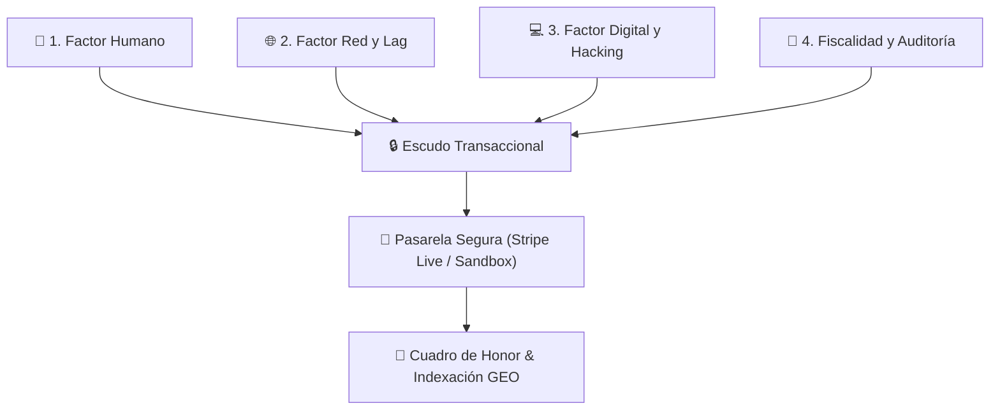
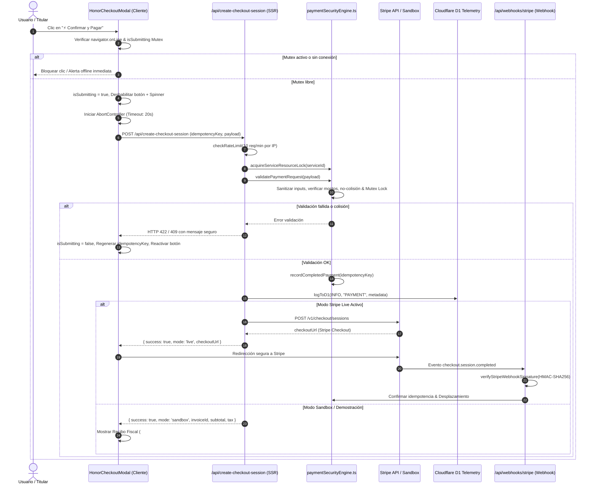

# 🛡️ Blindaje de Pagos, Idempotencia y Mitigación Integral de Riesgos (2026)

### Servicios Mallorca · Manual de Seguridad Financiera, Prevención de Fraude y Resiliencia Digital

---

## 1. Visión General y Filosofía de Riesgo Cero

La monetización de **Servicios Mallorca** mediante el Cuadro de Honor y el Posicionamiento Generativo (GEO) requiere una infraestructura financiera impenetrable. Ningún usuario debe sufrir cobros duplicados, ninguna transacción debe quedar congelada por latencia de red, y ningún actor malicioso debe poder manipular importes, reutilizar claves o falsificar confirmaciones de pasarela.

Este sistema implementa una **estrategia de defensa en profundidad de 4 capas**:

---

## 2. Matriz de Vectores de Riesgo y Mecanismos de Blindaje

| Dimensión   | Vector de Amenaza                            | Riesgo Potencial                       | Mecanismo de Blindaje Implementado                                                                                                                              | Archivo Responsable                                        |
| :---------- | :------------------------------------------- | :------------------------------------- | :-------------------------------------------------------------------------------------------------------------------------------------------------------------- | :--------------------------------------------------------- |
| **Humano**  | **Doble Clic / Impaciencia**                 | Doble cargo en tarjeta bancaria        | **Mutex de Exclusión Mutua (20s)** en cliente y servidor. Botón deshabilitado inmediatamente con spinner y `pointer-events: none`.                              | `HonorCheckoutModal.astro` `paymentSecurityEngine.ts`   |
| **Humano**  | **Reenvío Accidental (Enter / F5)**          | Generación de sesiones paralelas       | Event listeners con bloqueo `isSubmitting = true`. Formulario previene `submit` nativo repetido.                                                                | `HonorCheckoutModal.astro`                                 |
| **Humano**  | **Arrepentimiento / Cancelación**            | Bloqueo zombi del comercio             | Si el usuario cancela en el modal o en Stripe (`cancel_url`), los bloqueos temporales se liberan y se muestra una notificación de cancelación limpia sin cargo. | `HonorCheckoutModal.astro` `cuadro-de-honor.astro`      |
| **Humano**  | **Datos Fiscales Inválidos**                 | Factura fiscal nula / infracción AEAT  | Validación sintáctica estricta de CIF, NIF, NIE y VAT europeo (`isValidFiscalTaxId`). Normalización de espacios y mayúsculas.                                   | `paymentSecurityEngine.ts`                                 |
| **Red**     | **Microcortes / Lags (3G/4G/5G)**            | Petición colgada indefinidamente       | **`AbortController` con Timeout de 20s**. Si se supera, se aborta la petición, se informa al usuario y se libera el estado.                                     | `HonorCheckoutModal.astro`                                 |
| **Red**     | **Navegador Offline**                        | Peticiones muertas y frustración       | Comprobación previa de `navigator.onLine`. Aviso instantáneo antes de disparar paquetes de red.                                                                 | `HonorCheckoutModal.astro`                                 |
| **Red**     | **Reintentos tras Fallo**                    | Colisión con la clave anterior         | Si ocurre cualquier fallo o timeout, se **regenera automáticamente una nueva `idempotencyKey`** limpia con nuevo salt criptográfico.                            | `HonorCheckoutModal.astro`                                 |
| **Digital** | **Ataques de Replay (Re-envío)**             | Reutilización de token capturado       | **Libro Mayor de Idempotencia (`completedPaymentLedger`)**: si una clave ya fue procesada, se rechaza la duplicación y se retorna el recibo original.           | `paymentSecurityEngine.ts`                                 |
| **Digital** | **Price Tampering (Manipulación)**           | Pagar 0.01€ por un puesto de 100€      | Clamping forzado en servidor (`validateAndSanitizeAmount`): `1.00€ <= x <= 50,000.00€`. Cálculo server-side del 21% de IVA (nunca confiar en el cliente).       | `paymentSecurityEngine.ts` `create-checkout-session.ts` |
| **Digital** | **Condiciones de Carrera (Race Conditions)** | Dos pujas simultáneas por el puesto #1 | **Bloqueo de Concurrencia por Recurso (`acquireServiceResourceLock`)**: solo se procesa una puja a la vez por cada comercio (TTL 10s).                          | `paymentSecurityEngine.ts`                                 |
| **Digital** | **Colisión de Importes**                     | Empate de importes en Cuadro de Honor  | **Regla Estricta +1€**: Verificación en `validateUniqueHonorAmount` para que cada puesto represente un récord exclusivo.                                        | `paymentSecurityEngine.ts`                                 |
| **Hacking** | **DDoS / Flooding de Pasarela**              | Agotamiento de cuota de Stripe         | **Rate Limiting Financiero**: máximo 10 solicitudes de checkout por IP/cliente por minuto (`checkRateLimit`).                                                   | `create-checkout-session.ts` `rateLimiter.ts`           |
| **Hacking** | **Inyecciones (XSS, SQLi, D1)**              | Robo de sesión o corrupción            | **Sanitización Profunda de Strings (`sanitizePaymentInput`)**: eliminación de `<script>`, etiquetas HTML, comillas y caracteres de control.                     | `paymentSecurityEngine.ts`                                 |
| **Hacking** | **Webhook Spoofing (Falsos Pagos)**          | Simulación de pago completado          | **Verificación Criptográfica HMAC-SHA256 (`verifyStripeWebhookSignature`)** usando Web Crypto API nativa con tolerancia máxima de 300s.                         | `stripe.ts` `paymentSecurityEngine.ts`                  |

---

## 3. Diagrama de Secuencia de la Transacción Segura

---

## 4. Respuestas ante Situaciones de Red y Lag

### 4.1. Microcortes y Latencia > 20 segundos

Cuando un dispositivo móvil experimenta una desconexión o lentitud extrema en una red 3G/4G/5G de la isla, el `AbortController` interrumpe la conexión tras exactamente 20 segundos:

- Se muestra un aviso no intrusivo: _"La conexión con la pasarela bancaria ha superado el tiempo límite de espera (20 segundos) debido a latencia o microcorte de red. Por tu seguridad, la operación se ha cancelado sin cargo."_
- El estado `isSubmitting` se restablece a `false`.
- El botón de pago se vuelve a habilitar inmediatamente.
- Se invoca `refreshIdempotencyKey()` para dotar a la siguiente tentativa de una nueva clave limpia, evitando que una petición colgada anterior bloquee el reintento.

### 4.2. Retorno desde Stripe Checkout (`cancel_url` y `success_url`)

Si el usuario sale de Stripe o decide cancelar:

- Stripe redirige a: `/es/cuadro-de-honor?payment=cancelled&service=slug`.
- La página `cuadro-de-honor.astro` intercepta el parámetro y despliega un banner de estado informativo:
  > _"ℹ️ Proceso de Pago Cancelado: No se ha realizado ningún cobro en tu tarjeta ni cuenta bancaria. Si deseas impulsar o posicionar tu comercio más adelante, puedes seleccionar el negocio en cualquier momento."_
- La URL en la barra de direcciones se limpia automáticamente con `window.history.replaceState` para que una recarga no vuelva a disparar el mensaje.

---

## 5. Blindaje Criptográfico en Webhooks de Stripe

Para evitar que atacantes simulen pagos exitosos inyectando llamadas POST directas al endpoint `/api/webhooks/stripe`:

1. **Firma Obligatoria**: Se extrae la cabecera `stripe-signature` con timestamp `t` y firmas `v1`.
2. **Tolerancia Temporal**: Se descartan firmas con más de 300 segundos de desfase (prevención de ataques de reproducción).
3. **Web Crypto HMAC-SHA256**: Se computa la firma sobre `${timestamp}.${rawBody}` con el secreto `STRIPE_WEBHOOK_SECRET`.
4. **Comparación en Tiempo Constante**: Se comparan las firmas byte a byte con operación XOR constante (`diff |= sig.charCodeAt(i) ^ expected.charCodeAt(i)`) para anular posibles ataques de temporización (_timing attacks_).

---

## 6. Pruebas y Cobertura de Calidad (GR-05)

Toda la infraestructura está validada mediante suites de pruebas unitarias automáticas:

- **`tests/unit/paymentRiskMitigation.test.ts`**: 15 pruebas cubriendo sanitización XSS, validación de NIF/CIF, redondeo exacto de divisa, mutex de doble clic, expiración de TTL, bloqueo de recursos concurrentes, replay attacks y verificación HMAC de webhooks.
- **`tests/unit/paymentSecurityAndCollision.test.ts`**: 10 pruebas cubriendo la regla de no-colisión del Cuadro de Honor (+1€) y la integración del recibo fiscal.

---

_Servicios Mallorca · Sistema de Blindaje Financiero v2026.09_
