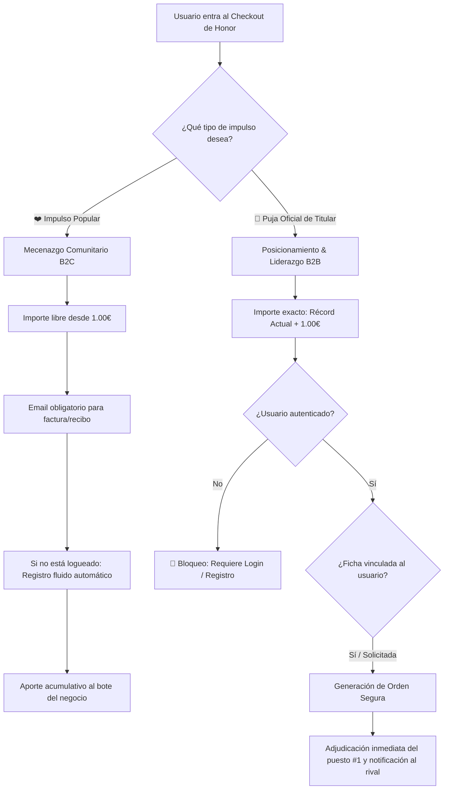
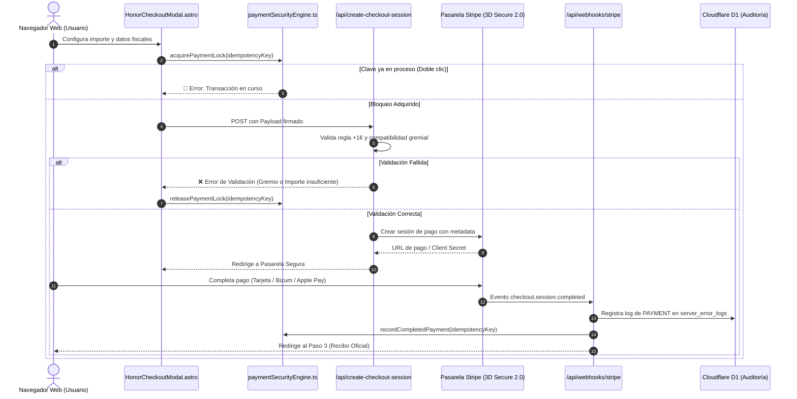

# 🏛️ Especificación Arquitectónica: Sistema Maestro de Pagos, Verificación de Titularidad y Cuadro de Honor

**Documento Oficial de Diseño Definitivo y Estándar Operativo**  
_Plataforma Servicios Mallorca · Versión 2026 · Cumplimiento de Golden Rules_

---

## 🎯 1. Visión y Diagnóstico de Fallos Previos

Para que la plataforma sea escalable, legalmente inexpugnable, transparente y segura, el sistema de monetización, mecenazgo y Cuadro de Honor debe resolver de raíz las vulnerabilidades detectadas en versiones preliminares:

### ⚠️ Matriz de Fallos Previos vs. Solución Definitiva

| Vector de Riesgo / Fallo Previo           | Consecuencia Negativa                                                                  | Solución Definitiva (Sistema Maestro)                                                                                                          |
| :---------------------------------------- | :------------------------------------------------------------------------------------- | :--------------------------------------------------------------------------------------------------------------------------------------------- |
| **1. Pagos de Titular Anónimos**          | Un usuario sin cuenta podía pagar como "Titular Oficial" de un negocio ajeno.          | **Autenticación Obligatoria:** Para postular o pujar como Titular, se exige login activo y vinculación de ficha (`claimedServiceId`).          |
| **2. Fuga de Categorías Gremiales**       | Un fontanero podía aparecer en la lista de bodegas o restaurantes.                     | **Aislamiento Gremial Estricto:** Validación de matriz de compatibilidad (`categoryFilter`) en cliente y backend antes de generar la sesión.   |
| **3. Falta de Transparencia de Pasarela** | El usuario no sabía si la pasarela emitía cargos bancarios reales o estaba en pruebas. | **Control de Estado `PUBLIC_PAYMENTS_LIVE`:** Banner visual transparente cuatrilingüe y recibos demarcados como Sandbox cuando proceda.        |
| **4. Colisiones de Pujas Concurrentes**   | Dos usuarios podían intentar pagar el mismo importe simultáneamente.                   | **Mutext de Idempotencia y Regla +1€:** Reserva de bloqueo temporal (`inFlightLocks`) por 15 segundos y chequeo de récord atómico.             |
| **5. Pagos Huérfanos sin Factura Fiscal** | Dificultad para asociar facturas B2B con 21% IVA a la contabilidad de la empresa.      | **Emisión Automatizada de Facturas:** Generación de recibo fiscal con desglose de IVA (21%), ID de serie `INV-HONOR-YYYY-XXXX` y descarga PDF. |

---

## 👥 2. Los Dos Modelos de Pago Claramente Diferenciados

---

### 👑 A. Puja Oficial de Titular (B2B Business Model)

- **Objetivo:** Permitir al dueño o gestor acreditado del negocio catapultar su empresa al **Puesto #1 Diamante** de su gremio.
- **Mecánica:** Debe superar el récord vigente en **exactamente +1.00€** (o +2€, +5€, etc.).
- **Requisitos Inmutables:**
  1. **Autenticación Obligatoria:** No se admiten pujas de titular como invitado anónimo.
  2. **Validación Gremial:** El negocio debe pertenecer a la categoría permitida por la lista de honor.
  3. **Facturación Fiscal:** Opción por defecto de introducir CIF/NIF y Razón Social para deducción del 21% IVA.
  4. **Panel de Control:** El negocio queda indexado en el perfil del usuario (`/profile?tab=business`).

---

### ❤️ B. Impulso Popular (B2C Community Crowdfunding)

- **Objetivo:** Permitir a clientes satisfechos, vecinos y admiradores apoyar a su comercio local favorito.
- **Mecánica:** Aportación acumulativa libre desde **1.00€**. Si la suma de micro-aportaciones de vecinos supera al récord vigente, el negocio sube de puesto gracias a la comunidad.
- **Requisitos:**
  1. **Email Verificado:** Obligatorio para recibir la factura legal y evitar abusos de pasarela.
  2. **Nombre o Alias Público:** Para aparecer en la lista de mecenas ("Patrocinado por Juan G. con 5.00€").
  3. **Mensaje de Dedicatoria Opcional:** Máximo 140 caracteres, sujeto a filtro de contenido tóxico.

---

## 🔒 3. Protocolo de Seguridad Financiera e Idempotencia (2026)

---

## ⚖️ 4. Matriz de Cumplimiento Legal y Fiscal (España / UE)

1. **IVA Balear del 21%:**
   - Toda aportación o puja se considera prestación de servicios publicitarios digitales.
   - La base imponible y la cuota de IVA se calculan con fórmula fiscal estándar:
     $$\text{Subtotal} = \frac{\text{Importe Total}}{1.21}, \quad \text{IVA (21\%)} = \text{Total} - \text{Subtotal}$$
2. **Facturación Electrónica B2B (Ley Crea y Crece / Veri\*Factu):**
   - Cada transacción genera un número de factura correlativo inmutable: `INV-HONOR-2026-XXXX`.
   - Los datos fiscales (CIF/NIF, Razón Social, Dirección) quedan almacenados en la auditoría para inspección tributaria.
3. **Derecho de Desistimiento y Anti-Blanqueo:**
   - Al ser un servicio de posicionamiento digital ejecutado inmediatamente tras el pago, el usuario acepta la renuncia al derecho de desistimiento conforme al art. 103 del TRLGDCU.
   - Límite estricto de **2.500€ por transacción única** para prevenir riesgos de blanqueo sin identificación reforzada previa.

---

## 🌐 5. Sistema de Estados de Pasarela (Sandbox vs. Live)

Para garantizar la máxima transparencia con el usuario final (según **GR-11** y **GR-13**):

1. **Estado Sandbox (`PUBLIC_PAYMENTS_LIVE=false`):**
   - Se muestra un banner amarillo/ámbar de advertencia: _"🧪 MODO DEMOSTRACIÓN: Pasarela bancaria real en fase de auditoría técnica. Ningún cargo real será emitido."_
   - El recibo final se marca como _"Simulación de Prueba / Sandbox"_.
   - Permite validar la interfaz, la lógica de cálculo y la UX sin requerir tarjetas reales.
2. **Estado Producción Real (`PUBLIC_PAYMENTS_LIVE=true`):**
   - Conexión directa con la API de Stripe en modo Live (`sk_live_...`).
   - Validación bancaria obligatoria 3D Secure 2.0 (SCA / Directiva PSD2).
   - Confirmación irrevocable antes de alterar los rankings en la base de datos D1.

---

## 📋 6. Reglas de Implementación en Código

1. **Aislamiento de Componentes:**
   - El modal central es [HonorCheckoutModal.astro](file:///c:/Users/ink.enzo/Desktop/p/servicios-mallorca/src/components/HonorCheckoutModal.astro).
   - La lógica de negocio está desacoplada en [honorBoardEngine.ts](file:///c:/Users/ink.enzo/Desktop/p/servicios-mallorca/src/lib/honorBoardEngine.ts) y [paymentSecurityEngine.ts](file:///c:/Users/ink.enzo/Desktop/p/servicios-mallorca/src/lib/paymentSecurityEngine.ts).
2. **Cero Textos Hardcodeados:**
   - Todas las etiquetas, errores, pasos y recibos deben obtenerse de `translations["honor.modal.*"]` en los 4 idiomas oficiales (`es`, `en`, `ca`, `de`).
3. **Mobile-First & Accesibilidad:**
   - El modal debe ser 100% usable en pantallas móviles de hasta 320px de ancho.
   - Los botones de paso deben contar con atributos `aria-selected`, roles `tablist` y navegación accesible por teclado.
