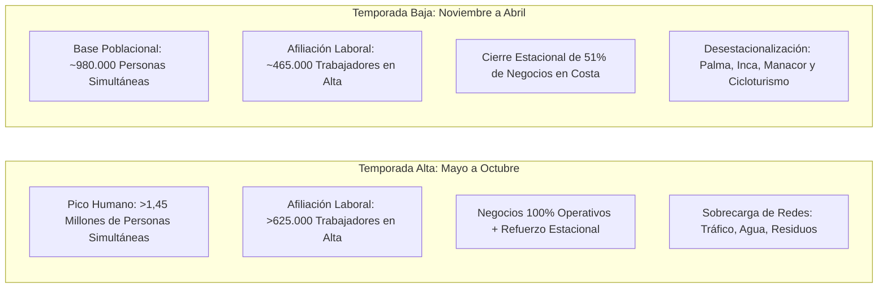

# 🏖️ Inteligencia Socioeconómica, Estacionalidad y Coste de Vida en Mallorca (2026)

> **Documento Maestro de Análisis Macro y Microeconómico Insular.**  
> Profundiza en la realidad estructural de Mallorca: la brecha de estacionalidad verano/invierno, el Índice de Presión Humana (IPH), el crecimiento demográfico en la última década, los salarios reales, el esfuerzo de acceso a la vivienda y la fiscalidad autonómica. Rige la analítica del Data Hub y la línea editorial conforme a **GR-11 (Zero Fake Data)**.

---

## 1. 🧭 La Realidad Dual de Mallorca: Verano vs Invierno

Mallorca no tiene una economía estática, sino una **economía de fuelle con oscilaciones extremas de actividad** que condicionan los negocios, el empleo, el transporte y el coste de vida.

---

## 2. 📊 Los Grandes Factores Socioeconómicos de la Isla

---

### Factores 1 & 2: Índice de Presión Humana (IPH) y Visitantes Anuales

Para responder a la pregunta: _"¿Cuánta gente hay realmente en Mallorca en cada momento?"_, el **IBESTAT** elabora el **Índice de Presión Humana (IPH)**, que suma en una fecha concreta a la población residente empadronada, a los turistas alojados y descuenta a los residentes que viajan fuera.

| Indicador Oficial                                 | Valor Oficial Contrastado                     | Período de Referencia | Fuente Oficial / Código            |
| ------------------------------------------------- | --------------------------------------------- | --------------------- | ---------------------------------- |
| **Población Residente Oficial**                   | **956.418 habitantes empadronados**           | 2025/2026             | IBESTAT `010101` (Padrón Continuo) |
| **Pico Máximo de Presión Humana (Agosto)**        | **1.468.200 personas simultáneas**            | Mes de Agosto         | IBESTAT `IPH-MALLORCA`             |
| **Mínimo Anual de Presión Humana (Enero)**        | **978.450 personas simultáneas**              | Mes de Enero          | IBESTAT `IPH-MALLORCA`             |
| **Brecha Poblacional Estival**                    | **+489.750 personas de sobrecarga (+50,1%)**  | Verano vs Invierno    | IBESTAT `IPH-MALLORCA`             |
| **Turistas Totales al Año en Mallorca**           | **14.850.000 turistas**                       | Anual                 | FRONTUR / EGATUR Balears           |
| **Tráfico Total en Aeropuerto PMI Son Sant Joan** | **31.250.000 pasajeros (entradas + salidas)** | Anual                 | AENA Estadísticas Oficiales        |

#### Desglose de Mercados Emisores Turísticos Oficiales (FRONTUR Balears):

1. **Alemania:** 33,2 % del total de visitantes (~4,9 Millones).
2. **Reino Unido:** 25,8 % del total de visitantes (~3,8 Millones).
3. **España Peninsular (Nacional):** 17,6 % del total de visitantes (~2,6 Millones).
4. **Francia:** 6,4 % del total de visitantes (~950.000).
5. **Suiza y Países Nórdicos (Suecia, Dinamarca, Noruega):** 8,5 % del total (~1,2 Millones).

---

### Factor 3: Evolución Demográfica en la Última Década (2015 – 2025/2026)

Mallorca ha experimentado uno de los crecimientos demográficos más intensos de toda España y del sur de Europa:

- **Población en 2015:** 859.289 habitantes censados.
- **Población en 2025/2026:** 956.418 habitantes censados.
- **Incremento Neto en 10 Años:** **+97.129 nuevos residentes (+11,3%)**.
- **Composición Demográfica Actual:**
  - **Ciudadanos de Nacionalidad Española:** 78,1% (746.900 habitantes).
  - **Residentes de Origen Extranjero:** 21,9% (209.518 habitantes empadronados).
  - Principales nacionalidades residentes: Alemania (~35.000 empadronados), Reino Unido (~21.000), Italia (~18.500), Colombia y Marruecos.

---

### Factor 4: Estacionalidad Laboral y Régimen de Fijos Discontinuos

La estructura laboral insular presenta una brecha cíclica muy pronunciada:

| Mes / Período                     | Afiliados Totales en Alta en Mallorca | Tasa de Paro Registrado         | Situación Operativa                                   |
| --------------------------------- | ------------------------------------- | ------------------------------- | ----------------------------------------------------- |
| **Enero (Mínimo Anual)**          | **~465.000 afiliados**                | 11,8 %                          | Invernaje, mantenimiento naval, obras de reforma      |
| **Abril (Apertura de Temporada)** | **~540.000 afiliados**                | 8,2 %                           | Apertura hotelera, cicloturismo, contratación inicial |
| **Julio / Agosto (Pico Máximo)**  | **~625.000 afiliados**                | 5,4 % (Pleno empleo estacional) | Capacidad operativa al 100% en todos los sectores     |
| **Octubre (Cierre de Temporada)** | **~520.000 afiliados**                | 7,9 %                           | Final de temporada de sol y playa, balance anual      |

#### El Colectivo Fijo Discontinuo:

En Baleares, más de **85.000 trabajadores** están contratados bajo la modalidad de **fijos discontinuos**. Trabajan intensivamente entre 6 y 8 meses (marzo/abril a octubre) y perciben la prestación por desempleo o subsidio específico durante los meses de inactividad invernal.

---

### Factor 5: Salarios, Poder Adquisitivo y Coste de Vida

Para comprender el esfuerzo del ciudadano local en Mallorca:

#### Salario Medio Bruto Oficial (INE / IBESTAT - Decil Salarial):

- **Salario Medio Bruto en Baleares:** **~25.800 € / año (~1.840 € brutos/mes en 14 pagas)**.
- **Salario Mediano (el más común):** **~22.400 € / año (~1.600 € brutos/mes)**.
- **Disparidad Sectorial:**
  - Sector Financiero, Tecnológico y Náutico Especializado: > 36.000 € / año.
  - Sector Hostelería y Comercio (Convenio Balear): 21.000 € a 25.000 € / año (incluyendo pluses de nocturnidad y manutención).

#### Coste de la Vida e Inflación Insular (IPC Balear):

- **La Doble Insularidad:** Debido a los costes de flete marítimo y transporte de mercancías desde la península, el IPC de Baleares se sitúa históricamente entre **0,3 y 0,6 puntos porcentuales por encima de la media nacional**.
- La cesta de la compra básica (alimentos frescos, lácteos, carnes) soporta un sobrecoste medio estimado del **8% al 12%** frente a regiones peninsulares productoras.

---

### Factor 6: Mercado Inmobiliario y Esfuerzo de Acceso a la Vivienda

El mayor factor de tensión socioeconómica en Mallorca es la vivienda:

- **Precio Medio de Compraventa:** **~4.150 € / m² en Mallorca** (en Palma centro y Calvià supera los 5.200 € / m²).
- **Precio Medio del Alquiler:** **~16,20 € / m² / mes** (un piso estándar de 80 m² ronda los 1.300 € / mes).
- **Tasa de Esfuerzo Familiar:** Una familia residente destina de media el **46% al 52% de sus ingresos netos al pago del alquiler o cuota hipotecaria**, el porcentaje más alto de toda España (donde la media estatal se sitúa en el 33%).

---

### Factor 7: Fiscalidad Autonómica Relevante (Govern CAIB & ATIB)

Los tramos fiscales y deducciones oficiales que todo ciudadano y autónomo debe conocer:

1. **Impuesto sobre la Renta (IRPF Balear):**
   - Deducción de hasta **880 € anuales** por alquiler de vivienda habitual para menores de 36 años o personas con discapacidad.
   - Deducción de hasta **220 €** por hijo por gastos de guardería y educación de 0 a 3 años.
   - Deducción del 100% de gastos en libros de texto en educación obligatoria.
2. **Impuesto sobre Transmisiones Patrimoniales (ITP) - Bonificación Joven:**
   - **Tipo reducido del 0% (Bonificación al 100%)** en la compra de primera vivienda para jóvenes menores de 35 años (vivienda habitual de hasta 270.151 € según Decreto Ley 3/2023).
3. **Impuesto del Turismo Sostenible (ITS / "Ecotasa"):**
   - Gravamen oficial entre **1,00 € y 4,00 € por noche** según la categoría del alojamiento. Recaudación destinada a la preservación medioambiental, ciclo del agua y recuperación del patrimonio histórico insular.

---

## 3. 📰 Nuevas Oportunidades de Contenido Editorial para el Portal

Esta radiografía socioeconómica permite publicar artículos de máxima autoridad y debate ciudadano:

1. **"¿Por qué Mallorca es más cara? Desglosando el sobrecoste de la insularidad en la cesta de la compra y los negocios."**
2. **"La Gráfica del IPH: El día de mayor saturación de personas del año en Mallorca y qué significa para los servicios públicos."**
3. **"El Invierno en Mallorca: Qué comercios abren los 12 meses y cómo está cambiando la vida en los pueblos fuera de temporada."**
4. **"Guía de Vivienda y Sueldos: Cuánto cuesta realmente vivir y trabajar en Mallorca en 2026."**
5. **"Fijos Discontinuos en Baleares: Derechos, subsidios y cómo planificar el descanso estacional de invierno."**
6. **"La Bonificación del 100% del ITP: Pasos para comprar tu primera casa en Mallorca sin pagar transmisiones patrimoniales."**

---

## 4. 🗄️ Nuevas Métricas Integradas en `src/data/officialStats.ts`

| ID Métrica                       | Título Oficial                            | Valor Contrastado      | Fuente Primaria  | Código de Serie       |
| -------------------------------- | ----------------------------------------- | ---------------------- | ---------------- | --------------------- |
| `iph-pico-verano`                | Pico Máximo de Presión Humana en Mallorca | 1.468.200 personas     | IBESTAT          | `IBESTAT-IPH-MAX`     |
| `iph-minimo-invierno`            | Presión Humana Mínima Invernal            | 978.450 personas       | IBESTAT          | `IBESTAT-IPH-MIN`     |
| `crecimiento-demografico-decada` | Crecimiento Demográfico en 10 Años        | +11,3 % (+97.129 hab.) | IBESTAT          | `IBESTAT-CENSO-10Y`   |
| `afiliacion-pico-verano`         | Afiliados a la Seguridad Social en Verano | 625.400 trabajadores   | Seguridad Social | `SS-AFIL-SUMMER-PEAK` |
| `salario-medio-balears`          | Salario Medio Bruto Anual                 | 25.800 € / año         | INE / IBESTAT    | `INE-ETCL-BALEARS`    |
| `turistas-anuales-mallorca`      | Turistas Totales Anuales en Mallorca      | 14,85 M turistas       | FRONTUR / EGATUR | `FRONTUR-MALLORCA`    |
