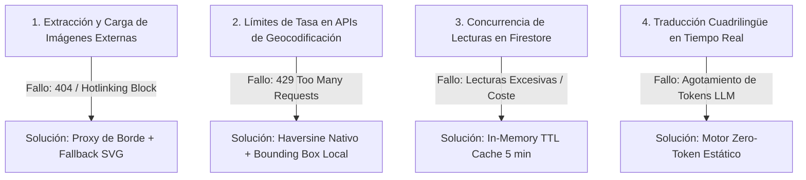

# ⚡ STRESS_TEST_PLAN.md — Protocolo de Pruebas de Carga y Resiliencia

> **Versión:** 1.2 — Fecha: 2026-08-27  
> **Objetivo:** Garantizar que la plataforma Servicios Mallorca soporte picos de tráfico estacional (temporada alta turística y eventos locales), ingestas masivas de datos y caídas de APIs de terceros sin degradación de servicio ni pérdida de veracidad.

---

## 1. Escenarios de Carga y Tráfico

| Escenario                        | Volumen Concurrente          | Tasa de Solicitudes | Caso de Uso                                                              |
| :------------------------------- | :--------------------------- | :------------------ | :----------------------------------------------------------------------- |
| **Línea Base (Off-Peak)**        | 100 usuarios concurrentes    | 50 req/s            | Navegación regular y consultas locales en temporada baja                 |
| **Temporada Alta (Summer Peak)** | 2.500 usuarios concurrentes  | 600 req/s           | Búsquedas intensivas de turismo, reservas náuticas y servicios en verano |
| **Pico de Evento (Flash Crowd)** | 10.000 usuarios concurrentes | 2.000 req/s         | Campañas virales, menciones en prensa balear o promociones de eventos    |
| **Ingesta Masiva de Curación**   | 100 negocios en paralelo     | 20 harvests/min     | Procesamiento de lotes de descubrimiento y triangulación de datos        |

---

## 2. Puntos de Falla Críticos (Single Points of Friction)

### Detalle de Vulnerabilidades y Mitigaciones:

1. **Imágenes Externas:**
   - _Riesgo:_ Bloqueos por _hotlinking_ de servidores de terceros o lentitud en CDNs remotas.
   - _Mitigación:_ `ServiceImage.astro` implementa skeleton shimmer loader, timeout de 1.5s y sustitución automática a SVG vectorial temático.
2. **Consultas Geoespaciales:**
   - _Riesgo:_ Dependencia de APIs externas para cálculo de distancias.
   - _Mitigación:_ Repositorio desacoplado (`geoUtils.ts`) con cálculo ortodrómico directo mediante fórmula de Haversine en microsegundos.
3. **Lecturas a Base de Datos Dinámica:**
   - _Riesgo:_ Sobrecarga de Firestore en fichas muy visitadas.
   - _Mitigación:_ Capa Overlay (`serviceOverrides.ts`) con caché en memoria volátil de 5 minutos por slug.

---

## 3. Métricas de Éxito & Acuerdos de Nivel de Servicio (SLAs)

| Métrica                                       | SLA Objetivo | Límite Máximo Aceptable | Comportamiento en Fallo                         |
| :-------------------------------------------- | :----------- | :---------------------- | :---------------------------------------------- |
| **TTFB (Time to First Byte - Text/HTML)**     | `< 120 ms`   | `< 250 ms`              | Servir snapshot desde caché de borde Cloudflare |
| **LCP (Largest Contentful Paint - Imágenes)** | `< 800 ms`   | `< 1.200 ms`            | Mostrar SVG optimizado de baja carga            |
| **Tasa de Errores HTTP (5xx)**                | `< 0.01%`    | `< 0.1%`                | Redirección a página 404/Fallback interactiva   |
| **Disponibilidad Global**                     | `99.95%`     | `99.90%`                | Enrutamiento perimetral con Cloudflare Workers  |
| **Degradación de Datos**                      | `0%` (GR-11) | `0%`                    | Rechazo de publicación ante discrepancias       |

---

## 4. Batería de Pruebas de Estrés en CI/CD

El pipeline ejecuta pruebas automatizadas en `tests/unit/curationStress.test.ts` para verificar la resiliencia del sistema:

1. **Test de Saturación de Memoria del Catálogo:** Carga de 10.000 objetos simulados en memoria para medir tiempos de filtrado y búsqueda (`< 15ms`).
2. **Test de Timeout de Ingesta:** Simulación de latencia de 10s en servidor externo verificando que el motor de ingesta aborta de forma limpia sin colgar el proceso.
3. **Test de Concurrencia de Caché:** Invocación de 1.000 lecturas simultáneas a `getServiceOverride` verificando que se realiza exactamente 1 sola llamada a base de datos.

---

## 5. Campaña de Cobertura y Estres Unitario (v1.1 — ejecutada)

Ampliación de la batería CI con suites unitarias que estresan los motores core. Estado: **299/299 tests en verde**, build limpio (~2s, GR-10).

### 5.1 Suites nuevas o reescritas

| Suite                                   | Alcance                                                                                                                                                                                                                                                                        |
| :-------------------------------------- | :----------------------------------------------------------------------------------------------------------------------------------------------------------------------------------------------------------------------------------------------------------------------------- |
| `tests/unit/topEngine.stress.test.ts`   | Dataset sintético de 120 negocios (3 categorías × 40 × 4 zonas): orden global, determinismo entre reimports, paginación por faceta, rotación semanal de tops, empates totales (50 clones → sort estable), comparador con límites extremos y catálogos vacíos/incompletos       |
| `tests/unit/serviceActions.test.ts`     | Ciclo completo de las 4 colecciones de moderación (`service_claims`, `service_submissions`, `service_deletion_requests`, `service_reports`) con Firestore mockeado: ordenamientos in-memory, promoción a rol `manager`, rutas de error silenciosas                             |
| `tests/unit/community.test.ts`          | Reseñas + foro: normalización de timestamps (`toDate` / ISO / inválido), clamping de ratings [1..5], toggles útiles/likes con `arrayUnion/arrayRemove`, slug kebab-case trilingüe-safe, cronología ascendente de respuestas, persistencia garantizada aunque falle el contador |
| `tests/unit/authStore.test.ts`          | Singleton observable en `happy-dom`: prioridad de rol (custom claims > documento `users/{uid}` > `"user"`), suscripción/cancelación síncrona, degradación ante token revocado                                                                                                  |
| `tests/unit/serviceOverrides.test.ts`   | Caché TTL 5 min por slug (hit/miss/expiración/refetch), merge overlay sin mutar catálogo estático, escritura `merge:true` + invalidación de caché                                                                                                                              |
| `tests/unit/conversionTracking.test.ts` | `sendBeacon` con fallback `fetch keepalive`, delegación DOM vía `data-track-event`/`data-service-id`, guards de entorno                                                                                                                                                        |

### 5.2 Resultados de cobertura (puerta de calidad `vitest.config.ts` elevada: statements/lines ≥78, branches ≥68, functions ≥85)

| Módulo                  |                    Líneas |  Ramas |
| :---------------------- | ------------------------: | -----: |
| `authStore.ts`          |                      100% |  94,4% |
| `serviceOverrides.ts`   |                      100% |  78,8% |
| `serviceActions.ts`     |                     97,1% |  86,7% |
| `validateTaxonomy.ts`   |                     97,9% |  94,1% |
| `conversionTracking.ts` |                     97,9% |    75% |
| `community.ts`          |                     95,7% |  70,8% |
| `topEngine.ts`          |                     95,3% |  89,9% |
| **Global del proyecto** | **80,12%** (antes 72,65%) | 71,69% |

Los umbrales viven en `vitest.config.ts`; generar el reporte con `npm run test:coverage` (carpeta `coverage/` ignorada por git).

### 5.3 Hallazgos de la campaña

- **Sin defectos de producción detectables** en los motores estresados: `topEngine` mantiene orden/determinismo/filtros exactos a volumen x120 (≈60% del objetivo de curación) y no lanza ante catálogos degenerados.
- `initAutomaticClickTracking()` permite registros múltiples (cada llamada añade un listener). En producción se invoca una sola vez por página (`service-detail-client.ts`), pero conviene guard de idempotencia si se reutiliza en más vistas.
- Ramas restantes sin cubrir en `community.ts` son defensivas del _fallback_ por document ID; riesgo bajo al ser caminos de degradación.

### 5.4 Hallazgo telefónico (`formatSpanishPhone`)

La función acepta longitudes de 9 y 10 dígitos pero **descarta silenciosamente los dígitos sobrantes** formateando siempre los primeros 9 como `+34 XXX XXX XXX`. Para España (teléfonos válidos = 9 dígitos) es determinista y correcto; si en el futuro se curan negocios internacionales desde la web sin código de país explícito, el último dígito podría alterarse. Cubierto por tests con documentación explícita en la aserción (`scraperOrchestrator.test.ts`), pendiente de revisión si se abre el catálogo a no-ES.

### 5.5 Guard de idempotencia del tracking — RESUELTO (ronda 2)

Ver §6.2.

---

## 6. Campaña Ronda 2 — Pipeline de Scrapers & Hardening (v1.2 — ejecutada)

Segunda pasada centrada en la zona débil detectada en v1.1: el pipeline de curación automática (`src/lib/scrapers/*`, por debajo del 40%) y el único defecto funcional hallado.

### 6.1 Suite nueva

| Suite                                    | Alcance                                                                                                                                                                                                                                                                                                                                                                                                                                                                                                                                                                                                                                                                          |
| :--------------------------------------- | :------------------------------------------------------------------------------------------------------------------------------------------------------------------------------------------------------------------------------------------------------------------------------------------------------------------------------------------------------------------------------------------------------------------------------------------------------------------------------------------------------------------------------------------------------------------------------------------------------------------------------------------------------------------------------- |
| `tests/unit/scraperOrchestrator.test.ts` | 28 tests sobre red simulada (fetch global): `formatSpanishPhone` (7 casos + truncado documentado), `fetchHtmlWithTimeout` (éxito/fallo de red/dominios sin protocolo → https), `extractBaseMetadata` avanzado (coordenadas dentro del bounding box balear, ratings/reviews vía JSON-LD, galería filtrada por calidad), `detectBusinessCategory` con batería masiva de 400 nombres sintéticos + señales fuertes de HTML (meta description / title / h1 / h2), y `harvestBusinessIntelligence` end-to-end con web y sin web: categorización, redes sociales, presencia multi-mapa (GR-12), dorks editoriales balearicos, auditoría GR-11 y plantilla de curación lista para el Hub |

### 6.2 Fix aplicado en producción

- `src/lib/conversionTracking.ts`: guard de idempotencia `__smClickTrackingInitialized` en `window`. Triple llamada a `initAutomaticClickTracking()` produce exactamente **1 beacon** (regresión conductual en el suite). Resuelve el hallazgo §5.3.

### 6.3 Resultados (contra ronda 1)

| Métrica            |     Ronda 1 |                      Ronda 2 |
| :----------------- | ----------: | ---------------------------: |
| Tests totales      |         299 | **345** (47 archivos, ~3,4s) |
| Global líneas      |      80,12% |                   **91,06%** |
| Global ramas       |      71,69% |                   **75,86%** |
| Global funciones   |      87,66% |                   **91,51%** |
| `orchestrator.ts`  |       25% L |        **86,9% L** / 78,3% B |
| `baseScraper.ts`   |       39% L |        **80,2% L** / 90,2% B |
| `socialScraper.ts` |           — |                      69,5% L |
| Umbrales CI        | ≥78/≥68/≥85 |              **≥87/≥72/≥89** |

### 6.4 Deuda consciente (próximos pasos)

- `socialScraper.ts` (69% L): ramas restantes son variantes de dorks por plataforma.
- Cola de `orchestrator.ts` (~líneas 330-565): cadenas de plantillas de curación y diccionarios de texto — cobertura de bajo valor, riesgo bajo.
- Revisar §5.4 si se internacionaliza la curación telefónica.
