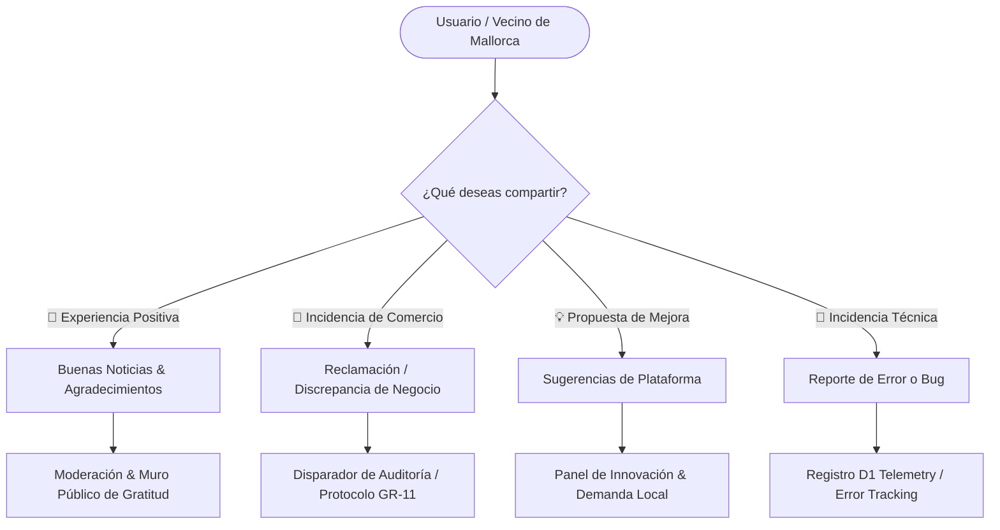

# 📢 Voz de la Comunidad: Sistema de Feedback, Quejas, Reclamaciones y Buenas Noticias

> **Documento de Especificación y Diseño Técnico para la Futura Implementación (Roadmap 2026)**  
> **Objetivo:** Dotar a Servicios Mallorca de un canal bidireccional y transparente donde residentes, turistas y propietarios expresen qué necesita la plataforma, qué errores o fallos detectan y qué comercios o experiencias destacan positivamente.

---

## 🎯 1. Visión y Propósito Estratégico

Para mantener un ecosistema vivo, ético y líder en las Islas Baleares, la plataforma debe escuchar activamente a sus usuarios:

1. **Detectar qué nos hace falta:** Demandas de nuevos oficios, gremios en pueblos remotos de la Part Forana (Tramuntana, Pla, Raiguer, Migjorn, Llevant) o funcionalidades ausentes en la web.
2. **Identificar qué nos falla:** Discrepancias en fichas de negocios (teléfonos cambiados, horarios no sincronizados, negocios traspasados/cerrados) o fallos de usabilidad.
3. **Celebrar lo que más gusta (Buenas Noticias):** Dar visibilidad a historias de excelencia artesanal, atención sobresaliente y comercios tradicionales que enorgullecen a Mallorca.

---

## 🧭 2. Tipologías de Mensajes de la Comunidad

El sistema categorizará el feedback en **4 canales bien diferenciados**:



### 🌟 A. Buenas Noticias & Muro de Gratitud Local

- **Propósito:** Reconocer públicamente el buen hacer de negocios, profesionales o eventos de Mallorca.
- **Campos:** Comercio vinculado (opcional), Municipio, Historia/Experiencia, Fotos reales (opcional), Nombre/Alias del autor.
- **Destino:** Se publican (tras moderación anti-spam) en el _Muro de Buenas Noticias de Mallorca_ y suman puntos al cálculo de confianza popular del negocio.

### 📢 B. Reclamaciones & Discrepancias sobre Fichas

- **Propósito:** Denunciar información inexacta o mala praxis para mantener la regla **Zero Fake Data (GR-11)**.
- **Motivos frecuentes:**
  - `Negocio cerrado permanentemente o traspasado`
  - `Teléfono o dirección errónea`
  - `Horarios publicados no coinciden con la realidad`
  - `Precios o condiciones abusivas no declaradas`
- **Destino:** Crea una tarea de auditoría prioritaria en `scripts/reharvest-intelligence.ts` y notifica al titular verificado si la ficha está reclamada.

### 💡 C. Sugerencias de Plataforma ("¿Qué nos hace falta?")

- **Propósito:** Co-crear la evolución de Servicios Mallorca con los residentes.
- **Ejemplos:** "Añadir filtro para restaurantes con menú celíaco en Inca", "Crear una sección para guías de senderismo local en Sóller".
- **Destino:** Votación comunitaria (Upvotes) en el Panel de Sugerencias.

### 🐛 D. Reporte Técnico de Errores ("¿Qué nos falla?")

- **Propósito:** Notificar bugs en dispositivos móviles, errores visuales o enlaces rotos.
- **Captura automática:** Dispositivo, navegador, viewport, URL actual y log contextual de consola (vía `devtools-logger.js`).

---

## 🏗️ 3. Arquitectura Técnica y Modelo de Datos

### Esquema de Base de Datos (Cloudflare D1 / Firestore)

```typescript
export type FeedbackType = "GOOD_NEWS" | "BIZ_CLAIM" | "FEATURE_SUGGESTION" | "BUG_REPORT";
export type FeedbackStatus = "PENDING_REVIEW" | "APPROVED_PUBLIC" | "IN_AUDIT" | "RESOLVED" | "DISCARDED";

export interface CommunityVoiceEntry {
  id: string; // "fb_2026_xxxx"
  type: FeedbackType;
  status: FeedbackStatus;
  createdAt: string; // ISO 8601
  locale: "es" | "en" | "ca" | "de";

  // Datos del Emisor (RGPD Friendly / GR-13)
  userUid?: string;
  userName: string; // "Miquel B." o "Anónimo"
  userEmail?: string; // Para avisar cuando su propuesta sea atendida
  isResident: boolean; // ¿Residente en Mallorca?

  // Contenido
  title: string;
  message: string;
  zoneId?: string; // "palma", "manacor", "soller"...
  serviceSlug?: string; // Negocio relacionado (si aplica)
  sentimentScore?: number; // -1.0 (Crítico) a +1.0 (Excelente)

  // Metadatos Técnicos
  userAgent?: string;
  viewportSize?: string;
  currentUrl?: string;
  ipHash?: string; // Hash unidireccional para anti-spam

  // Resolución y Auditoría
  moderatedBy?: string;
  moderatorNotes?: string;
  publicReply?: string; // Respuesta oficial de la plataforma
  resolvedAt?: string;
}
```

---

## 🔒 4. Seguridad, Privacidad y Anti-Spam (GR-11 & GR-13)

1. **Protección Anti-Spam y Bots:**
   - Integración con **Cloudflare Turnstile** invisible en el formulario.
   - Límite de envíos por IP (máximo 3 reportes por hora por usuario no registrado).
2. **Cumplimiento RGPD (GR-13):**
   - Casilla explícita de consentimiento para tratamiento del mensaje.
   - Opción de publicar bajo seudónimo/alias para proteger la privacidad del usuario.
   - Derecho de supresión inmediato previa petición.
3. **Blindaje contra Difamaciones o Guerras Comerciales:**
   - Las reclamaciones negativas sobre un negocio **nunca se publican automáticamente sin verificación**. Se inicia un protocolo de comprobación telefónica o revisión de fuentes oficiales antes de aplicar cualquier sanción al `confidenceScore`.

---

## 📈 5. Impacto en el Algoritmo de Confianza (Confidence Engine)

El feedback verificado retroalimenta dinámicamente la reputación del negocio en el catálogo:

| Tipo de Feedback Comprobado                     | Impacto en Confidence Score | Acción Automática                                        |
| :---------------------------------------------- | :-------------------------- | :------------------------------------------------------- |
| **3+ Buenas Noticias Verificadas**              | 📈 +3% a +5% de Confianza   | Insignia _"Comercio Amado por la Comunidad"_             |
| **Horario o Teléfono Corregido por Usuario**    | 🔄 Re-indexación inmediata  | Ficha actualizada con sello _"Verificada recientemente"_ |
| **Negocio Reportado como Cerrado (Confirmado)** | 🛑 Desactivación temporal   | Marcado como `permanently_closed` (Zero Fake Data)       |
| **Reclamación de Mal Servicio Corroborada**     | 📉 -5% a -10% de Confianza  | Notificación al propietario con opción de respuesta      |

---

## 🚀 6. Fases de Implementación Propuestas

### 📌 Fase 1: Componente Flotante & Página de Feedback `/buzon-comunitario`

- Creación de [`src/components/CommunityVoiceModal.astro`](file:///c:/Users/ink.enzo/Desktop/p/servicios-mallorca/src/components/CommunityVoiceModal.astro).
- Ruta cuatrilingüe `/es/comunidad/buzon`, `/en/community/voice`, `/ca/comunitat/veu`, `/de/community/stimme`.
- Endpoint SSR seguro en `/api/feedback/submit.ts` con validación Zod y log en D1.

### 📌 Fase 2: Muro de Buenas Noticias de Mallorca

- Sección visual en la página de inicio o en `/buenas-noticias` donde se celebran historias locales y comercios destacados por los vecinos.
- Filtros por municipio (Palma, Inca, Manacor, Calvià, Alcúdia, etc.).

### 📌 Fase 3: Cuadro de Mando para Administradores

- Vista protegida en `/admin/feedback` para clasificar sugerencias, aprobar buenas noticias y gestionar discrepancias de fichas.
- Gráficos de tendencias de satisfacción y palabras clave más demandadas.

---

## 📝 7. Checklist de Cumplimiento de Golden Rules

- [x] **GR-01:** Uso estricto de variables CSS de `global.css` para el diseño de modales y tarjetas.
- [x] **GR-02:** Responsive completo en breakpoints 480 / 640 / 768 / 1024 px.
- [x] **GR-03:** Tipado estricto en TypeScript (`CommunityVoiceEntry`).
- [x] **GR-04:** Textos 100% traducidos en los 4 idiomas (`es`, `en`, `ca`, `de`).
- [x] **GR-11:** Cero reseñas falsas: verificación obligatoria antes de alterar puntuaciones de negocios.
- [x] **GR-13:** Blindaje RGPD y cabeceras de seguridad.
- [x] **GR-15:** Telemetría conectada a Cloudflare D1.
