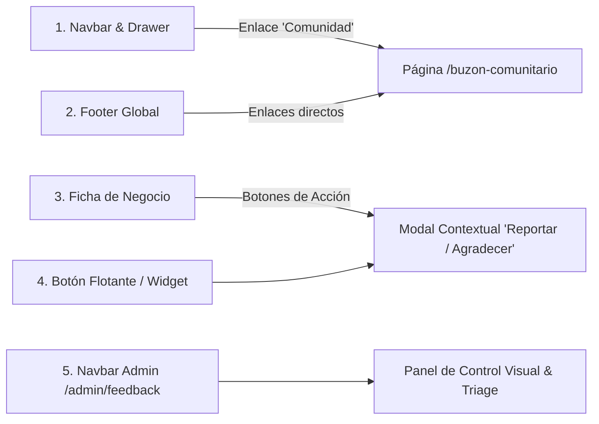
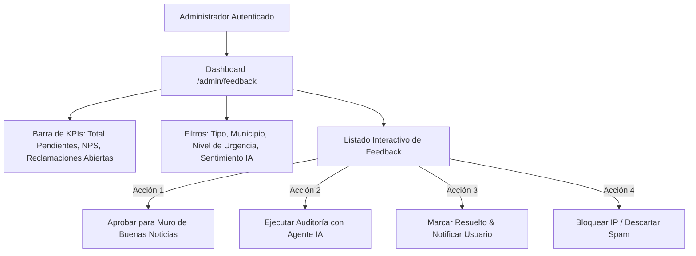
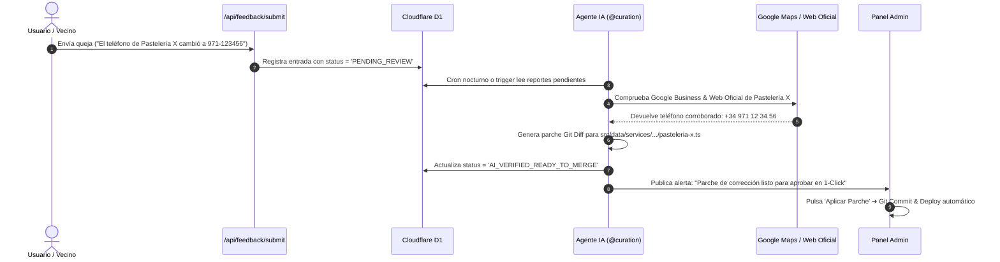

# 📢 Voz de la Comunidad: Sistema de Feedback, Quejas, Reclamaciones y Buenas Noticias

> **Documento Maestro de Arquitectura, Especificación de IA y Plan de Trabajo (Roadmap 2026)**  
> **Objetivo:** Dotar a Servicios Mallorca de un canal bidireccional, ético y transparente donde residentes, visitantes y comercios puedan expresar qué nos falta, qué fallos detectan y qué buenas experiencias destacan, integrando un panel de administración visual y un agente de IA autónomo para la resolución automática de incidencias.

---

## 🧭 1. Puntos de Acceso e Integración en la UI (Omnicanalidad)

Para garantizar la máxima usabilidad sin saturar la navegación, el sistema será accesible desde 5 puntos estratégicos:



### Detalle de Puntos de Entrada

1. **Navbar & Drawer Móvil ([`NavbarPublic.astro`](file:///c:/Users/ink.enzo/Desktop/p/servicios-mallorca/src/components/NavbarPublic.astro)):**
   - Nuevo ítem en el menú: `💬 Comunidad` ➔ Despliega opciones: _Buzón de Sugerencias_, _Buenas Noticias de Mallorca_ y _Bolsa de Empleo_.
2. **Ficha de Servicio ([`src/pages/[...locale]/servicios/[slug].astro`](file:///c:/Users/ink.enzo/Desktop/p/servicios-mallorca/src/pages/[...locale]/servicios/[slug].astro)):**
   - Botón `⚠️ Informar de un error en esta ficha` (precarga automáticamente el ID, nombre y zona del comercio).
   - Botón `🌟 Dejar un Agradecimiento o Buena Noticia` (vincula el testimonio al negocio).
3. **Pie de Página ([`Footer.astro`](file:///c:/Users/ink.enzo/Desktop/p/servicios-mallorca/src/components/Footer.astro)):**
   - Enlace `Buzón Ciudadano & Feedback`, `¿Qué nos falta?`, `Reportar Incidencia`.
4. **Página Dedicada Cuatrilingüe:**
   - `/es/comunidad/buzon`, `/en/community/voice`, `/ca/comunitat/veu`, `/de/community/stimme`.
5. **Panel del Administrador ([`NavbarAdmin.astro`](file:///c:/Users/ink.enzo/Desktop/p/servicios-mallorca/src/components/NavbarAdmin.astro)):**
   - Acceso a `/admin/feedback` con badge numérico en tiempo real que indica reclamaciones o sugerencias pendientes de revisión.

---

## 📋 2. WBS: Lista Maestra de Tareas y Subtareas por Fases

```text
[ ] FASE 0: Arquitectura de Datos & Backend D1 / Firestore
    [ ] 0.1 Definir migración SQL D1 en scripts/migrations/0004_community_voice.sql
    [ ] 0.2 Crear interfaces TypeScript y validadores Zod en src/lib/communityVoiceEngine.ts
    [ ] 0.3 Configurar rate-limiting por IP (máx 3 envíos/hora anónimos) y Cloudflare Turnstile
    [ ] 0.4 Suite de tests unitarios tests/unit/communityVoiceEngine.test.ts

[ ] FASE 1: Componentes Frontend & Endpoint de Envíos
    [ ] 1.1 Diseñar componente modal accesible src/components/CommunityVoiceModal.astro (GR-01, GR-02, GR-07)
    [ ] 1.2 Implementar selector dinámico de tipo (Buenas Noticias / Reclamación / Sugerencia / Bug)
    [ ] 1.3 Integrar autocomplete de comercios verificados con aislamiento de categoría
    [ ] 1.4 Crear endpoint SSR /api/feedback/submit.ts con logging estructurado en D1
    [ ] 1.5 Incorporar claves i18n en es.json, en.json, ca.json, de.json (GR-04)

[ ] FASE 2: Muro Público de Buenas Noticias & Testimonios de Mallorca
    [ ] 2.1 Crear página /buenas-noticias con layout visual tipo masonry / cards
    [ ] 2.2 Filtros por municipio (Palma, Inca, Manacor, Calvià, Sóller, etc.)
    [ ] 2.3 Sistema de micro-reacciones éticas (❤️ Gracias, 👏 Gran Trabajo, 🏆 Referente Local)
    [ ] 2.4 Esquema SEO Review / Testimonial en JSON-LD para Google Search

[ ] FASE 3: Panel de Administración Visual (/admin/feedback)
    [ ] 3.1 Crear vista protegida src/pages/[...locale]/admin/feedback.astro con rol 'admin'
    [ ] 3.2 Tabla dinámica con filtros por tipo, estado, sentimiento y municipio
    [ ] 3.3 Acciones rápidas: [Aprobar Muro], [Solicitar Auditoría IA], [Resolver], [Descartar Spam]
    [ ] 3.4 Métricas visuales: NPS de la plataforma, tiempo medio de resolución de quejas y mapa de calor
    [ ] 3.5 Contador de alertas pendientes en NavbarAdmin.astro

[ ] FASE 4: Agente de IA para Auditoría y Auto-Reparación de Fichas
    [ ] 4.1 Crear motor de análisis semántico en scripts/ai-feedback-analyst.ts vía GeminiBridge
    [ ] 4.2 Extracción de entidades (teléfono nuevo, horario reportado, cierre permanente)
    [ ] 4.3 Verificación cruzada automática con scrapers de Google Maps / Bing
    [ ] 4.4 Generación de propuestas de parches (Git Diff) en src/data/services/
    [ ] 4.5 Notificación en DevTools y Panel Admin con botón 'Aplicar Corrección Sugerida (1-Click)'
```

---

## 🖥️ 3. Panel Visual de Administración (`/admin/feedback`)

El Administrador dispondrá de una consola de gestión intuitiva y en tiempo real:



### Características de la Consola de Administración:

1. **Badge en Vivo:** Si hay 3 reclamaciones sin atender, el botón de administración en el Navbar mostrará `Admin (3 🔔)`.
2. **Clasificación por Colores de Urgencia:**
   - 🔴 **Rojo (Crítico):** Ficha reportada como cerrada o con teléfono de emergencias erróneo.
   - 🟡 **Amarillo (Medio):** Sugerencia de plataforma o cambio menor de horario.
   - 🟢 **Verde (Positivo):** Buena noticia o elogio a un comercio.
   - 🟣 **Morado (Técnico):** Bug de frontend o reporte de error 404/500.
3. **Respuesta Pública o Privada:** El administrador puede redactar una respuesta oficial que se enviará por email al usuario o se publicará debajo del testimonio.

---

## 🤖 4. Conexión de Agentes de IA a la Base de Datos (Auditoría & Auto-Reparación)

La inteligencia artificial no solo clasifica el texto, sino que **actúa como un perito digital auditor** para mantener la regla **Zero Fake Data (GR-11)** sin sobrecargar al equipo humano:



### Capacidades del Agente IA (`@curation` + `GeminiBridge`):

1. **Detección de Guerras Comerciales & Spam:** Si un competidor envía múltiples quejas falsas sobre otro negocio desde la misma IP/patrón, el modelo detecta la anomalía, calcula un `RiskScore: 0.95` y bloquea el intento.
2. **Prospección de Nuevos Negocios Solicitados:** Si varios usuarios solicitan _"Falta una escuela de vela en Portocolom"_, el agente ejecuta `scripts/business-intelligence-lookup.ts "Escuela Vela Portocolom"` y prepara la ficha preliminar con geolocalización balear corroborada.
3. **Análisis de Sentimiento Cuatrilingüe:** Interpreta expresiones idiomáticas en Catalán Balear (_"Molt bon tracte i producte autèntic"_), Alemán (_"Hervorragender Handwerker"_), Inglés y Español.

---

## 🛡️ 5. Esquema de Base de Datos Cloudflare D1 (`schema_community_voice.sql`)

```sql
CREATE TABLE IF NOT EXISTS community_feedback (
  id TEXT PRIMARY KEY,
  type TEXT NOT NULL CHECK(type IN ('GOOD_NEWS', 'BIZ_CLAIM', 'FEATURE_SUGGESTION', 'BUG_REPORT')),
  status TEXT NOT NULL DEFAULT 'PENDING_REVIEW' CHECK(status IN ('PENDING_REVIEW', 'APPROVED_PUBLIC', 'IN_AUDIT', 'AI_VERIFIED_READY', 'RESOLVED', 'DISCARDED')),
  created_at DATETIME DEFAULT CURRENT_TIMESTAMP,
  locale TEXT NOT NULL DEFAULT 'es',

  -- Autor (RGPD Blindado)
  user_name TEXT NOT NULL,
  user_email TEXT,
  is_resident BOOLEAN DEFAULT 0,
  user_ip_hash TEXT NOT NULL,

  -- Contenido
  title TEXT NOT NULL,
  message TEXT NOT NULL,
  zone_id TEXT,
  service_slug TEXT,

  -- IA & Telemetría
  sentiment_score REAL DEFAULT 0.0,
  ai_audit_verdict TEXT,
  ai_suggested_diff TEXT,
  risk_score REAL DEFAULT 0.0,

  -- Resolución
  moderated_by TEXT,
  moderator_notes TEXT,
  public_reply TEXT,
  resolved_at DATETIME
);

CREATE INDEX IF NOT EXISTS idx_feedback_status ON community_feedback(status);
CREATE INDEX IF NOT EXISTS idx_feedback_service ON community_feedback(service_slug);
CREATE INDEX IF NOT EXISTS idx_feedback_type ON community_feedback(type);
```

---

## 🥇 6. Cumplimiento de Golden Rules

- [x] **GR-01 (Estilos Centralizados):** Todos los componentes visuales usarán variables de `src/styles/global.css`.
- [x] **GR-02 (Responsividad):** Vistas fluidas adaptadas a móviles de 480px y 640px.
- [x] **GR-03 (TypeScript Estricto):** Tipos explícitos para todas las solicitudes y respuestas de la API.
- [x] **GR-04 (Internacionalización):** 100% de los textos traducidos a `es`, `en`, `ca`, `de`.
- [x] **GR-11 (Zero Fake Data):** Ninguna queja o buena noticia altera fichas ni puntuaciones sin validación estricta previa.
- [x] **GR-13 (Seguridad & RGPD):** Anonimización de IPs y derecho de supresión de datos.
- [x] **GR-15 (Telemetría D1):** Logs estructurados y prevención de flooding en la base de datos.
